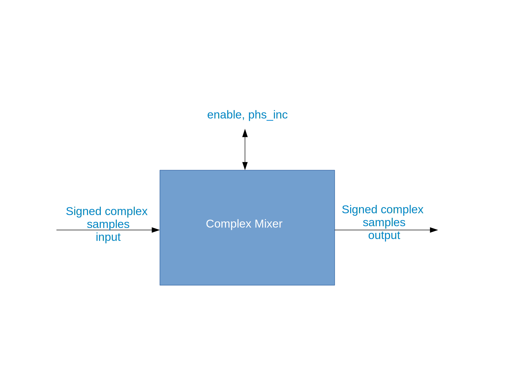

.. complex_mixer documentation

.. _complex_mixer:

Complex Mixer (``complex_mixer``)
=================================
Multiplies complex IQ data input with a digital sine wave generated by a numerically-controlled oscillator (NCO).
``complex_mixer`` is an asset in the ``ocpi.assets.dsp_comps`` component library. Implementations include the
:ref:`complex_mixer-HDL-worker` (``complex_mixer.hdl``) and the :ref:`complex_mixer-RCC-worker` (``complex_mixer.rcc``).
Tested platforms include
``alst4``, ``isim``, ``matchstiq-z1`` (PL), ``ml605``, ``modelsim``, ``xsim``, and Zedboard(PL).

Design
------
The complex mixer consists of a numerically-controlled oscillator (NCO) and a complex multiplier.
The component receives complex signed samples on its input port, performs a complex multiply
with a digital sine wave generated by its NCO, and then places the resulting output, which
is a frequency-shifted version of the input data, on its output port.

A block diagram representation of the implementation is given in :numref:`complex_mixer-diagram`

.. _complex_mixer-diagram:

   Complex Mixer Block Diagram

Interface
---------
.. literalinclude:: ../specs/complex_mixer-spec.xml
   :language: xml

Properties
~~~~~~~~~~
.. ocpi_documentation_properties::

Ports
~~~~~
.. ocpi_documentation_ports::

   in: Signed complex samples.
   out: Signed complex samples.

Implementations
---------------
.. ocpi_documentation_implementations:: ../complex_mixer.hdl ../complex_mixer.rcc

Example Application
-------------------
.. literalinclude:: example_app.xml
   :language: xml

Dependencies
------------
The dependencies on other elements in OpenCPI are:

 * None.

Limitations
-----------
Limitations of ``complex_mixer`` are:

 * None.

Testing
-------

Test cases for the complex mixer are derived from the number of
properties and their respective values as listed in
``complex_mixer-test.xml``.  The following test cases
are implemented to validate the ``complex_mixer`` component:

* Bypass mode, where the input data is forwarded to the output port.
  To verify this case, the test byte-wise compares the output file
  to the input file.

* Normal mode, where the NCO is configured to tune the input signal
  to baseband. To verify this case, the test performs an FFT of the output data
  and checks the max value of the FFT to be at DC (0Hz).

For both of these cases, the input file contains a tone of 12.5Hz sampled at 100Hz
and an amplitude of 32767.

.. ocpi_documentation_test_result_summary::
