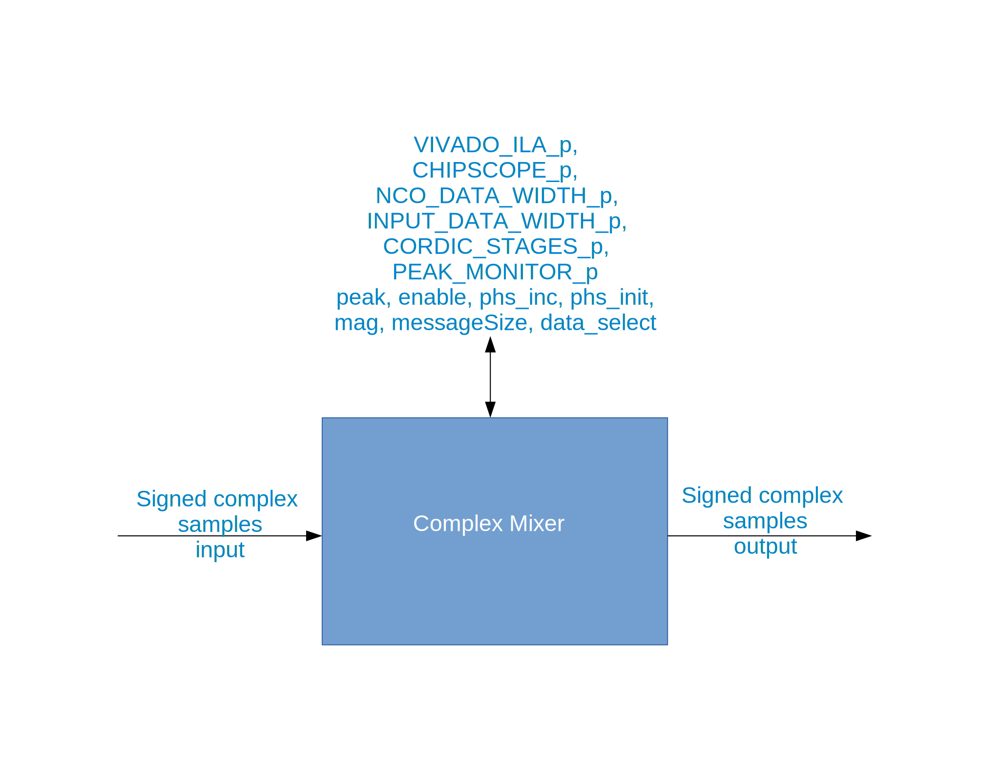
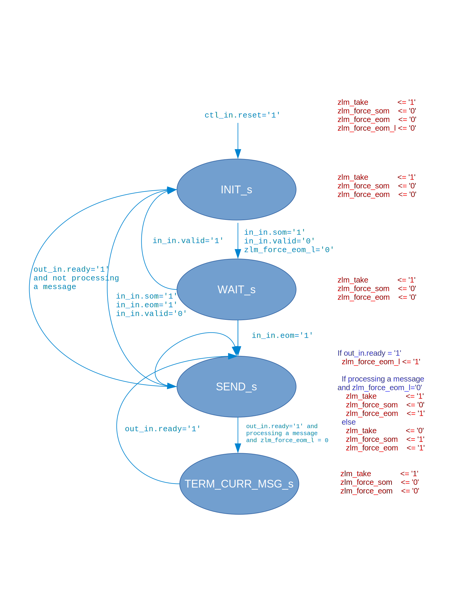

.. complex_mixer HDL worker

.. This file is protected by Copyright. Please refer to the COPYRIGHT file
   distributed with this source distribution.

   This file is part of OpenCPI <http://www.opencpi.org>

   OpenCPI is free software: you can redistribute it and/or modify it under the
   terms of the GNU Lesser General Public License as published by the Free
   Software Foundation, either version 3 of the License, or (at your option) any
   later version.

   OpenCPI is distributed in the hope that it will be useful, but WITHOUT ANY
   WARRANTY; without even the implied warranty of MERCHANTABILITY or FITNESS FOR
   A PARTICULAR PURPOSE. See the GNU Lesser General Public License for
   more details.

   You should have received a copy of the GNU Lesser General Public License
   along with this program. If not, see <http://www.gnu.org/licenses/>.

:orphan:

.. _complex_mixer-HDL-worker:

``complex_mixer`` HDL Worker
============================
Application worker HDL implementation
with settable runtime configuration parameters
and a numerically-controlled oscillator (NCO) that
uses the coordinate rotation digital computer (CORDIC) algorithm to
generate the digital sine wave for the complex multiply operation.

Detail
------

The following figure shows a functional representation of the HDL implementation:

.. figure:: ../complex_mixer.test/doc/figures/complex_mixer_block_diagram.jpg
   :alt: Complex Mixer Functional Diagram
   :align: center

   Complex Mixer Functional Diagram

Build-time parameters can be used to control the width of the NCO data output (``NCO_DATA_WIDTH_p``),
the width of the input data (``INPUT_DATA_WIDTH_p``), the number of stages in the
Coordinate Rotation Digital Computer (CORDIC) used to implement the NCO (``CORDIC_STAGES_p``)
and the amplitude of the NCO's sine wave (``mag``).
There are also parameters to control insertion of a peak detection circuit (``PEAK_MONITOR_p``)
a Chipscope circuit (``CHIPSCOPE_p``, and a Vivado integrated logic analyzer (``VIVADO_ILA_p``).

The peak detector has two inputs and does not compute magnitude.  The output of the
the peak detector (``peak``) is either the peak of I or the peak of Q, whichever is greater.

The ``enable`` input is available to either enable (``true``) or bypass (``false``) the circuit.
In bypass mode, the HDL worker does not use pipe-lining registers. It uses FPGA multipliers to
process input data at the full clock rate. The HDL worker produces valid output
two clock cycles after each valid input.

The relationship between the frequency shift magnitude and the NCO output frequency
is given by the following equation:

.. math::

   nco\_output\_freq = sample\_freq*\frac{phs\_inc}{2^{phs\_acc\_width}}

In this equation:

* `phs_inc` is the NCO phase increment, which is runtime-configurable
  and has a data type of 16-bit signed short.

* `phs_acc_width` is fixed at 16.

* The input clock frequency is the sample rate of the samples.

A positive and negative `phs_inc` will mix up and down, respectively.
Use the following equation as an aid in setting `phs_inc` to have the desired mixing effect:

.. math::
   :label: positive-phs-inc-mixes-up

   x_{out}[n] = x_{in}[n] * \dfrac{mag}{2^{NCO\_DATA\_WIDTH\_p-1}} * e^{\big(j2\pi\big(sample\_freq * \dfrac{phs\_inc \; * \; n}{2^{phs\_acc\_width}}\big) + phs\_init\big)} \;\; \forall \;\; n, \; n \ge 0

The following figure shows a block diagram representation of the HDL implementation:

   Complex Mixer Block Diagram

   
.. ocpi_documentation_worker::
   
   mag: Must be in the range :math:`-2^{(NCO\_DATA\_WIDTH\_p-1)} <= mag <= 2^{(NCO\_DATA\_WIDTH\_p-1)}-1` for the worker to operate properly.
   data_select: 0 = input data, 1 = output of NCO.
   peak: Peak detector output. Either peak of I or peak of Q, whichever is greater.

  in: Signed complex samples.

  out: Signed complex samples.

Finite State Machine
~~~~~~~~~~~~~~~~~~~~
   
This worker implements only one finite state machine (FSM).  The FSM supports zero-length messages.
In future releases, this FSM will be replaced with a register delay-based mechanism currently used
in the ``dc_offset_filter`` HDL implementation.  The following figure illustrates this FSM:

   Complex Mixer Finite State Machine

Control Timing and Signals
~~~~~~~~~~~~~~~~~~~~~~~~~~

The complex mixer HDL worker uses the clock from the control plane and standard control plane signals.
There is a startup delay for this worker: once the input is ready and valid and the output is ready,
there is a delay of ``CORDIC_STAGES_p+3`` before the first sample is taken.  After the initial delay,
valid output data is given two clock cycles after input data is taken (latency=2).

Utilization
-----------
.. ocpi_documentation_utilization::
