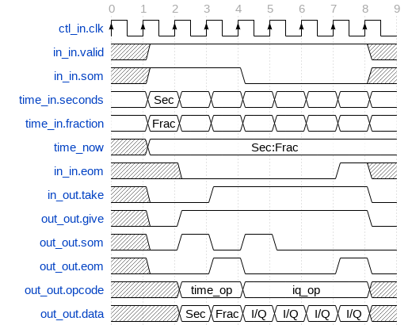

.. timestamper documentation

.. _timestamper:

Timestamper (``timestamper``)
=============================
Prepends complex IQ data input with a timestamp.
``timestamper`` is an asset in the ``ocpi.assets.util_comps`` component library.
Implementations include the :ref:`timestamper-HDL-worker` (``timestamper.hdl``).
Tested platforms include
``alst4``, ``e3xx``, ``isim``, ``matchstiq-z1`` (PL), ``ml605``, ``modelsim``, ``xsim``, and ``zed``.

Design
------
Inputs complex IQ data and outputs complex IQ data prepended with a timestamp.
One timestamp is sent for each data message produced on the output.

A block diagram representation of the implementation is given in :numref:`timestamper-diagram`

.. _timestamper-diagram:

.. figure:: ../timestamper.test/doc/figures/timestamper_top_level.jpg
   :alt: Timestamper Implementation Block Diagram
   :align: center

   Block diagram of timestamper implementation.

Timestamps are provided as an input to the component on the time interface.
The timestamp is a 64-bit number with the first 32 bits corresponding to seconds
and the last 32 bits corresponding to fractional seconds.  When a valid message
is detected on the input, the timestamp is registered by the component and given
on the output interface.  Timestamps and data are given on the output interface
using different opcodes.

The time interface from which the timestamps are generated originates from the
OpenCPI time server, which is instanced as part of the platform worker.
Furthermore, an additional component (time client) is dynamically instanced
by the framework for all components that declare time interfaces.
The time client communicates with the time server and produces the
time interface seen by the component.

A timing diagram of the output interface for the timestamper component
is given in :numref:`timestamper-timing-diagram`

.. _timestamper-timing-diagram:

   Timestamper output timing diagram.

Interface
---------
.. literalinclude:: ../specs/timestamper-spec.xml
   :language: xml

Ports
~~~~~
.. ocpi_documentation_ports::

   in: Signed complex samples.
   out: Signed complex samples with timestamps.

Opcode handling
~~~~~~~~~~~~~~~
To be supplied (if required): Description of how the non-stream opcodes are handled.

Properties
~~~~~~~~~~
.. ocpi_documentation_properties::

Parameters
~~~~~~~~~~
.. ocpi_documentation_properties::
   :parameters:

Implementations
---------------
.. ocpi_documentation_implementations:: ../timestamper.hdl

Example application
-------------------
.. literalinclude:: example_app.xml
   :language: xml

Dependencies
------------
The dependencies to other elements in OpenCPI are:

 * None.

There is also a dependency on:

 * ``ieee.std_logic_1164``

 * ``ieee.numeric_std``

 * Skeleton outline: Any other standard C++ or HDL packages.

Limitations
-----------
Limitations of ``timestamper`` are:

 * None.

Testing
-------
Two test cases are implemented to validate the timestamper component:

#. Bypass mode

#. Normal mode

For both test cases, the input file is a series of eight ramps with 32-bit values
ranging from 0 to 512.

For the bypass mode test case, the input data is forwarded to the output port.  For verification, the
output file is byte-wise compared to the input file.

For the normal mode test case, the expected output waveform is the identical ramp with timestamps
inserted before each data message.  For verification, the timestamps are
extracted and checked for incrementing values.

.. ocpi_documentation_test_result_summary::
