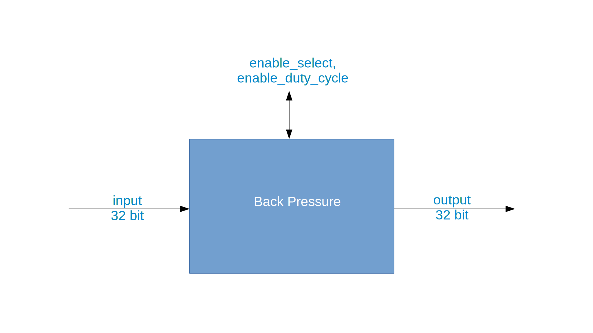

.. backpressure documentation

.. This file is protected by Copyright. Please refer to the COPYRIGHT file
   distributed with this source distribution.

   This file is part of OpenCPI <http://www.opencpi.org>

   OpenCPI is free software: you can redistribute it and/or modify it under the
   terms of the GNU Lesser General Public License as published by the Free
   Software Foundation, either version 3 of the License, or (at your option) any
   later version.

   OpenCPI is distributed in the hope that it will be useful, but WITHOUT ANY
   WARRANTY; without even the implied warranty of MERCHANTABILITY or FITNESS FOR
   A PARTICULAR PURPOSE. See the GNU Lesser General Public License for
   more details.

   You should have received a copy of the GNU Lesser General Public License
   along with this program. If not, see <http://www.gnu.org/licenses/>.

.. _backpressure:

Backpressure (``backpressure``)
===============================
Emulates the back pressure that is present in a system.
``backpressure`` is an asset in the ``ocpi.core`` component library.
Implementations include the
:ref:`backpressure-HDL-worker` (``backpressure.hdl``) and the :ref:`backpressure-RCC-worker` (``backpressure.rcc``).
Tested platforms include
``alst4``, ``centos7``, ``isim``, ``matchstiq-z1`` (PL), ``ml605``, ``modelsim``, ``xilinx13_3``, ``xsim``,  and Zedboard(PL).

Design
------
The back pressure component provides the ability to emulate the "back pressure" (resistance or force
opposing the desired flow of data through an application) that is present in a system.
It is primarily used during the development of an HDL worker, specifically during unit test simulations.
Back pressure within an OpenCPI system is a common occurrence that can be a result of resource-loading issues
or passing data between containers. Workers must be designed to handle system back pressure without
data loss.

A block diagram representation of the implementation is given in :numref:`backpressure-diagram`

.. _backpressure-diagram:

   Block diagram of back pressure implementation.

Interface
---------
.. literalinclude:: ../specs/backpressure-spec.xml
   :language: xml

Ports
~~~~~
.. ocpi_documentation_ports::

   in: 32 bits.
   out: 32 bits.

Set the output buffer size to match the input, which may be connected to a port with a protocol.

Opcode handling
~~~~~~~~~~~~~~~
To be supplied: Description of how the non-stream opcodes are handled.

Properties
~~~~~~~~~~
.. ocpi_documentation_properties::

   enable_select: Selects the back pressure scheme to control the "take" from the upstream worker.  ``true`` uses lfsr-15. ``false`` uses the setting in ``enable_duty_cycle``.

   enable_duty_cycle: Sets the "take" duty cycle. Possible values are:``1`` = constant (default), ``2`` = toggle (off/on), ``3`` = 1/on, 2/off, ``4`` = 1/on, 3/off.

Parameters
~~~~~~~~~~
.. ocpi_documentation_properties::
   :parameters:

Implementations
---------------
.. ocpi_documentation_implementations:: ../backpressure.hdl ../backpressure.rcc

Example application
-------------------
.. literalinclude:: example_app.xml
   :language: xml

Dependencies
------------
The dependencies on other elements in OpenCPI are:

 * None.

Limitations
-----------
Limitations of ``backpressure`` are:

 * None.

Testing
-------
The back pressure component is tested via the OpenCPI unit test framework.
The ``backpressure.test/`` component unit test suite directory contains the XML files
that describe the combination of tests.

Fundamentally, there are two test cases that are employed to verify the back pressure component:

* ``enable_select=true``: The most significant bit of the lfsr-15 drives the "take" signal of the input port.

* ``enable_select=false``: The ``enable_duty_cyle`` setting controls the duty cycle of the "take"
  signal of the input port.

In all test cases, the data is simply passed through the worker and the tests are determined
to be successful by comparing the input and output files. Due to its simplicity and use in
other tests, a binary data file is generated containing complex signed 16-bit samples with
a tone at a configurable center frequency and sample frequency. Plotting of the I/O data
is available, via ``View=1``, if desired.

.. ocpi_documentation_test_result_summary::
