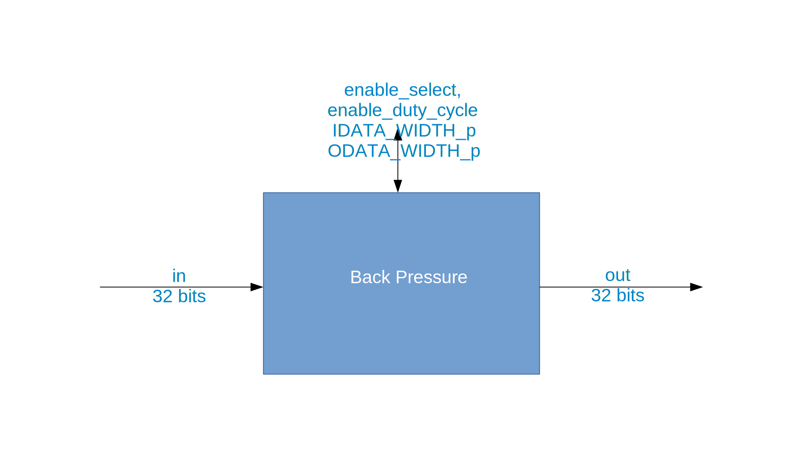

.. backpressure HDL worker

.. This file is protected by Copyright. Please refer to the COPYRIGHT file
   distributed with this source distribution.

   This file is part of OpenCPI <http://www.opencpi.org>

   OpenCPI is free software: you can redistribute it and/or modify it under the
   terms of the GNU Lesser General Public License as published by the Free
   Software Foundation, either version 3 of the License, or (at your option) any
   later version.

   OpenCPI is distributed in the hope that it will be useful, but WITHOUT ANY
   WARRANTY; without even the implied warranty of MERCHANTABILITY or FITNESS FOR
   A PARTICULAR PURPOSE. See the GNU Lesser General Public License for
   more details.

   You should have received a copy of the GNU Lesser General Public License
   along with this program. If not, see <http://www.gnu.org/licenses/>.

:orphan:

.. _backpressure-HDL-worker:

``backpressure`` HDL Worker
===========================
Application worker HDL implementation
with settable runtime configuration parameters
that applies back pressure to the upstream
worker in the application.

Detail
------

A back pressure HDL worker is built into a worker's unit test
HDL assembly and is used to force back pressure during the execution
of the application to exercise the worker's ability to correctly handle
back pressure.

The back pressure HDL worker does not manipulate the data; it simply passes
it through. Validation of this worker requires passing a known input
data pattern through the worker under its various modes and comparing
the input and output files to verify that the data is unchanged. Since
validation of the output is performed simply by comparing to the input,
any non-zero input data is sufficient.

The back pressure HDL worker does not explicitly define
input/output protocols. Since the input protocol is simply
bits, the input protocol is irrelevant and is defined by the
component that feeds it; for example, file read.
The back pressure HDL worker only applies back pressure
to the worker that is upstream within the application.

The following figure shows a block diagram representation of the HDL implementation:

   Back Pressure HDL Worker Block Diagram

.. ocpi_documentation_worker::

  in: Size defined by ``IDATA_WIDTH_p``.

  out: Sample size defined by ``ODATA_WITH_p``.

Finite State Machine
~~~~~~~~~~~~~~~~~~~~
Not applicable.

Control and Timing Signals
~~~~~~~~~~~~~~~~~~~~~~~~~~
The back pressure HDL worker uses the clock from
the control plane and standard control plane signals.  

