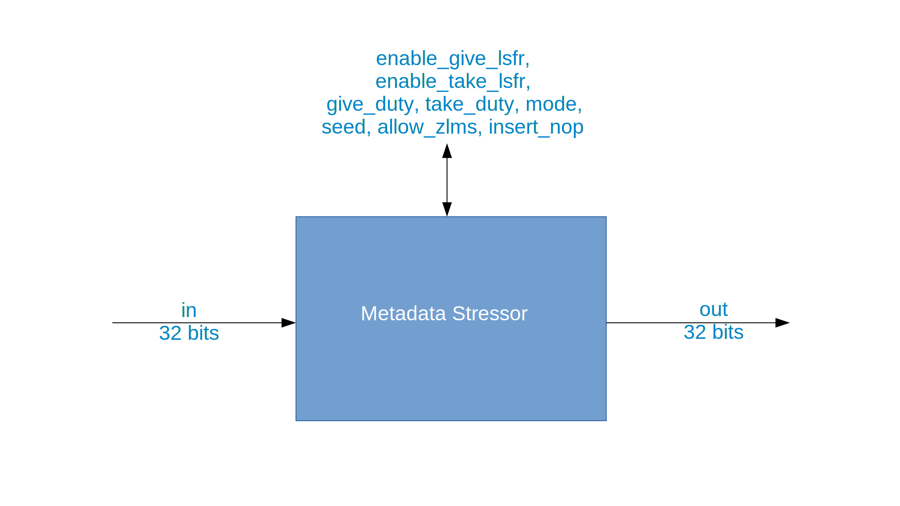

.. metadata_stressor documentation

.. This file is protected by Copyright. Please refer to the COPYRIGHT file
   distributed with this source distribution.

   This file is part of OpenCPI <http://www.opencpi.org>

   OpenCPI is free software: you can redistribute it and/or modify it under the
   terms of the GNU Lesser General Public License as published by the Free
   Software Foundation, either version 3 of the License, or (at your option) any
   later version.

   OpenCPI is distributed in the hope that it will be useful, but WITHOUT ANY
   WARRANTY; without even the implied warranty of MERCHANTABILITY or FITNESS FOR
   A PARTICULAR PURPOSE. See the GNU Lesser General Public License for
   more details.

   You should have received a copy of the GNU Lesser General Public License
   along with this program. If not, see <http://www.gnu.org/licenses/>.

.. _metadata_stressor:

Metadata stressor (``metadata_stressor``)
=========================================
Tests an HDL worker's robustness during development.
``metadata_stressor`` is an asset in the ``ocpi.core`` component library.
Implementations include the
:ref:`metadata_stressor-HDL-worker` (``metadata_stressor.hdl``) and the :ref:`metadata_stressor-RCC-worker` (``metadata_stressor.rcc``).
Tested platforms include
``alst4``, ``centos7``, ``isim``, ``matchstiq-z1`` (PL), ``ml605``, ``modelsim``, ``xilinx13_3``, ``xsim`` and Zedboard(PL).

Design
------
The metadata stressor component tests an HDL worker’s robustness during development as part of the OpenCPI unit test suite.
An HDL worker is expected to accept all valid combinations of metadata without failure, though some are unlikely to
be encountered in normal operation. It also may starve the unit under test of data and insert delays between messages.
The data starvation may be random or based on a duty cycle. The worker is automatically built into the HDL test
assemblies generated by the unit test framework. It can also add zero-length messages (ZLMs) between messages. It passes through
the data it receives without change.

A block diagram representation of the implementation is given in :numref:`metadata_stressor-diagram`

.. _metadata_stressor-diagram:

   Block diagram of metadata stressor component.

Interface
---------
.. literalinclude:: ../specs/metadata_stressor-spec.xml
   :language: xml

Ports
~~~~~
.. Comment out ocpi_documentation_ports. It fails on this component.

   in: 32 bits.
   out: 32 bits.

The HDL worker runtime configuration parameter ``DATA_WIDTH_p`` can be used to
set a custom data width for the ports.

Opcode handling
~~~~~~~~~~~~~~~
To be supplied: Description of how the non-stream opcodes are handled.

Properties
~~~~~~~~~~
.. Comment out ocpi_documentation_properties. It fails on this component.
   

Parameters
~~~~~~~~~~
.. Comment out ocpi_documentation_properties. It fails on this component.
.. Comment out parameters

Implementations
---------------
.. ocpi_documentation_implementations:: ../metadata_stressor.hdl ../metadata_stressor.rcc

Example application
-------------------
.. literalinclude:: example_app.xml
   :language: xml

Dependencies
------------
The dependencies on other elements in OpenCPI are:

 * None.

Limitations
-----------
Limitations of ``metadata_stressor`` are:

 * None.

Testing
-------

.. This information is from the data sheet.

The metadata stressor component is tested via the OpenCPI
unit test framework. The ``metadata_stressor.test/``
component unit test suite directory contains XML files
that describe the combinations of tests.
The test cases exercise changes in every property across
three cases, though not every property in every case, as that
would take a prohibitively long time.

Case 1 - Tests the component with crafted ZLMs and SWMs, backpressure on, timeout set to 120 seconds.
  
* ``enable_give_lsfr = True``: use lsfr to vary give
     
* ``enable_take_lsfr = True``: use lsfr to vary take
     
* ``insert_nop = True``: insert delay between messages
     
* ``mode = full``: vary data and metadata

Case 2 - Tests the component with eight byte messages, backpressure on, timeout set to 120 seconds.
  
* ``enable_give_lsfr = True``: use lsfr to vary give
     
* ``enable_take_lsfr = True``: use lsfr to vary take
     
* ``insert_nop = True``: insert delay between messages
     
* ``mode = full``: vary data and metadata

Case 3 - Tests the component with a single zlm, backpressure on, timeout set to 120 seconds.

* ``enable_give_lsfr = True``: use lsfr to vary give
     
* ``enable_take_lsfr = True``: use lsfr to vary take
     
* ``insert_nop = True``: insert delay between messages
     
* ``mode = full``: vary data and metadata

Case 4 - Tests the component with crafted ZLMs and SWMs, backpressure on, timeout set to 120 seconds.
  
* ``enable_give_lsfr = True``: use lsfr to vary give
     
* ``enable_take_lsfr = True``: use lsfr to vary take
     
* ``insert_nop = True``: insert delay between messages
     
* ``mode = full``: vary data and metadata
     
* ``mode = data``: only vary data
     
* ``mode = metadata``: only vary metadata
     
* ``mode = full``: vary data and metadata

Cases 5-11 - Tests ending on different message types, message size set to 4, stressormode set to full, backpressure on, timeout set to 120 seconds.
  
* ``mode = full``: vary data and metadata
     
* ``insert nop = True``: insert delay between messages
     
* ``insert nop = False``: no delay between messages

Case 12 - Tests most of the functionality, message size set to 128, backpressure on, stressormode set to full, timeout set to 240 seconds.
  
* ``enable_give_lsfr = True``: use lsfr to vary give
     
* ``enable_give_lsfr = False``: use duty cycle to vary give
     
* ``enable_take_lsfr = True``: use lsfr to vary take
     
* ``enable_take_lsfr = False``: use duty cycle to vary take
     
* ``give_duty = 1``: constant
     
* ``give_duty = 4``: 1on3off
     
* ``take_duty = 1``: constant
     
* ``take_duty = 5``: 1on4off
     
* ``mode = data``: only vary data
     
* ``mode = metadata``: only vary metadata
      
* ``mode = full``: vary data and metadata
      
* ``insert_nop = True``: insert delay between messages
      
* ``insert_nop = False``: no delay between messages
      
* ``seed = 35``: seed for lsfr

Case 13 - Tests the RCC version of this component, which is nothing but a placeholder, timeout set to 120 seconds.

In all test cases, the data is simply passed through the component and the tests
are determined to be successful by comparing the input and output files.

.. ocpi_documentation_test_result_summary::
