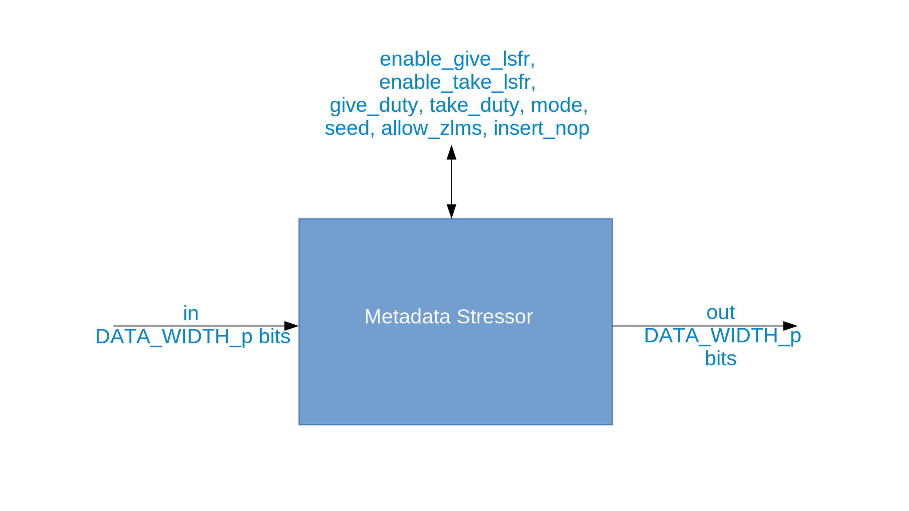

.. metadata_stressor HDL worker

.. This file is protected by Copyright. Please refer to the COPYRIGHT file
   distributed with this source distribution.

   This file is part of OpenCPI <http://www.opencpi.org>

   OpenCPI is free software: you can redistribute it and/or modify it under the
   terms of the GNU Lesser General Public License as published by the Free
   Software Foundation, either version 3 of the License, or (at your option) any
   later version.

   OpenCPI is distributed in the hope that it will be useful, but WITHOUT ANY
   WARRANTY; without even the implied warranty of MERCHANTABILITY or FITNESS FOR
   A PARTICULAR PURPOSE. See the GNU Lesser General Public License for
   more details.

   You should have received a copy of the GNU Lesser General Public License
   along with this program. If not, see <http://www.gnu.org/licenses/>.

:orphan:

.. _metadata_stressor-HDL-worker:

``metadata_stressor`` HDL Worker
================================
Application worker HDL implementation
with a settable runtime configuration parameter
for component port data width.

Detail
------
The metadata stressor HDL worker has four modes that control its primary operation:
bypass, data, metadata, and full. The ``mode`` property is used to establish the mode.

In bypass mode, the HDL worker passes through the data
and metadata it receives without change.

In data mode, the HDL worker passes through the
metadata associated with a message unchanged, but the data will be withheld based on
the duty cycle or lfsr, imitating data starvation for the unit under test.
(If the ``enable_take_lsfr`` property is not set to ``true`` or the
``take_duty`` property is not set to greater than 1,
the worker will set the duty cycle to 5.)

In metadata mode, the HDL worker passes through the data (not intentionally withholding
any data) but manipulates the metadata in the following ways:

* Early start of message (SOM), data, late end of message (EOM)
  
* Early SOM, data, EOM with data
  
* SOM with data, data, late EOM
  
* SOM with data, data, EOM with data, (single-word message if that is what is received)

* Zero-length message (if the ``allow_zlms`` property is ``true``)
  
It repeats those patterns so long as there is data.

In full mode, the HDL worker combines data and metadata modes, manipulating
both the metadata and starving the unit under test of data.
Do not use data mode and the ``allow_zlms`` property in combination.
Data mode does not allow for manipulation of metadata, so
zero-length messages cannot be inserted. Enabling both does
not cause a failure, but one behavior
will preclude the expression of the other.

The following figure shows a block diagram representation of the HDL implementation:

   Block diagram of metadata stressor HDL implementation.

.. ocpi_documentation_worker::

  in: Size defined by ``DATA_WIDTH_p``.

  out: Size defined by ``DATA_WIDTH_p``.

Finite State Machine
~~~~~~~~~~~~~~~~~~~~
The following figure shows an abbreviated representation of
the primary finite state machine implemented in the HDL version of the metadata stressor component.

.. figure:: ../metadata_stressor.test/doc/figures/ms_fsm_abrv.png
   :alt: Metadata Stressor Finite State Machine
   :align: center

   Finite state machine of metadata stressor HDL implementation.

Control Timing and Signals
~~~~~~~~~~~~~~~~~~~~~~~~~~
The metadata stressor HDL worker implementation uses the clock from
the control plane and standard control plane signals.

Utilization
-----------
.. ocpi_documentation_utilization::
