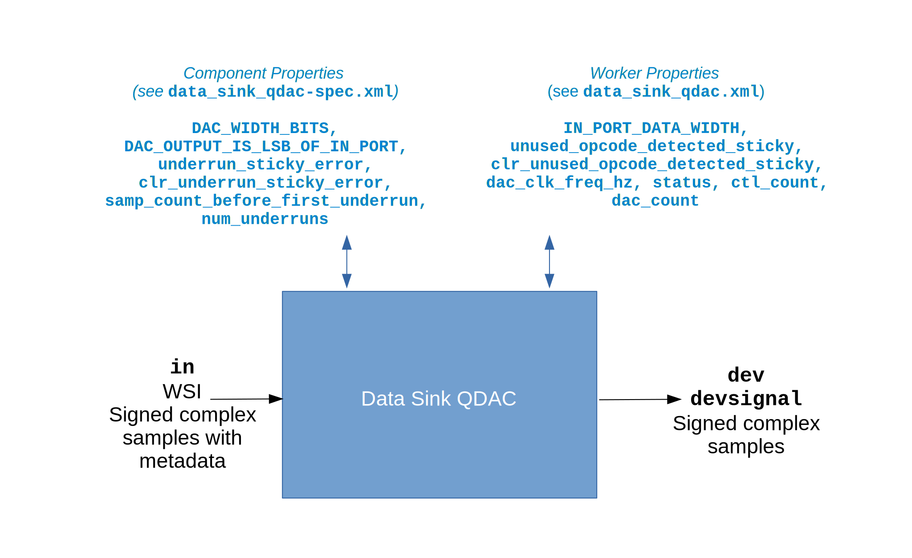

.. data_sink_qdac HDL worker

.. This file is protected by Copyright. Please refer to the COPYRIGHT file
   distributed with this source distribution.

   This file is part of OpenCPI <http://www.opencpi.org>

   OpenCPI is free software: you can redistribute it and/or modify it under the
   terms of the GNU Lesser General Public License as published by the Free
   Software Foundation, either version 3 of the License, or (at your option) any
   later version.

   OpenCPI is distributed in the hope that it will be useful, but WITHOUT ANY
   WARRANTY; without even the implied warranty of MERCHANTABILITY or FITNESS FOR
   A PARTICULAR PURPOSE. See the GNU Lesser General Public License for
   more details.

   You should have received a copy of the GNU Lesser General Public License
   along with this program. If not, see <http://www.gnu.org/licenses/>.

.. _data_sink_qdac-HDL-worker:

``data_sink_qdac`` HDL Device Worker
====================================
HDL device worker that provides functionality common to all DAC device types.

Detail
------
The data sink Quadratic Digital-to-Analog-Converter (QDAC) HDL device worker
implements the data sink Quadratic Digital-to-Analog-Converter (QDAC) component
specification, which provides the properties and ports that are necessary for this
HDL device worker to implement the
functionality that is common to all Digital-to-Analog Converter (DAC) device types.
This functionality includes:

* Interpreting input messages indicating end of data and finishing on end-of-file (EOF)

* Normalizing input data to the bit width of the device

* Providing an underrun indicator when the rate of input data is less than the DAC data rate

The data sink QDAC HDL device worker implementation is intended to be paired with
an HDL subdevice worker that translates the ``dev`` interface
to a device-specific interface.

A block diagram representation of the HDL device worker implementation is given in :numref:`data_sink_qdac-worker-diagram`

.. _data_sink_qdac-worker-diagram:

   Data Sink QDAC HDL Device Worker Block Diagram

.. note:: 
   In the figure above, "WSI" refers to the Worker Streaming Interface, which is described in the `OpenCPI HDL Development Guide <https://opencpi.gitlab.io/releases/latest/docs/OpenCPI_HDL_Development_Guide.pdf>`_.

Be sure to check the ``samp_count_before_first_underrun`` and ``num_underruns`` component properties
at the end of an application run because they are not stable until then.  The worker does not use
clock domain crossing (cdc) HDL primitive library circuits
for these properties because it takes
advantage of the fact that they will have a stable value by the time the OpenCPI control
plane reads them at the end of an application run.

For component properties implemented by this HDL device worker, see ``$OCPI_ROOT_DIR/projects/platform/hdl/devices/specs/data_sink_qadc-spec.xml``.

.. ocpi_documentation_worker::

   in: Size defined by ``IN_PORT_DATA_WIDTH``.
   on_off: See the `OpenCPI HDL Development Guide <https://opencpi.gitlab.io/releases/latest/docs/OpenCPI_HDL_Development_Guide.pdf>`_ for instructions on calculating the default value.

