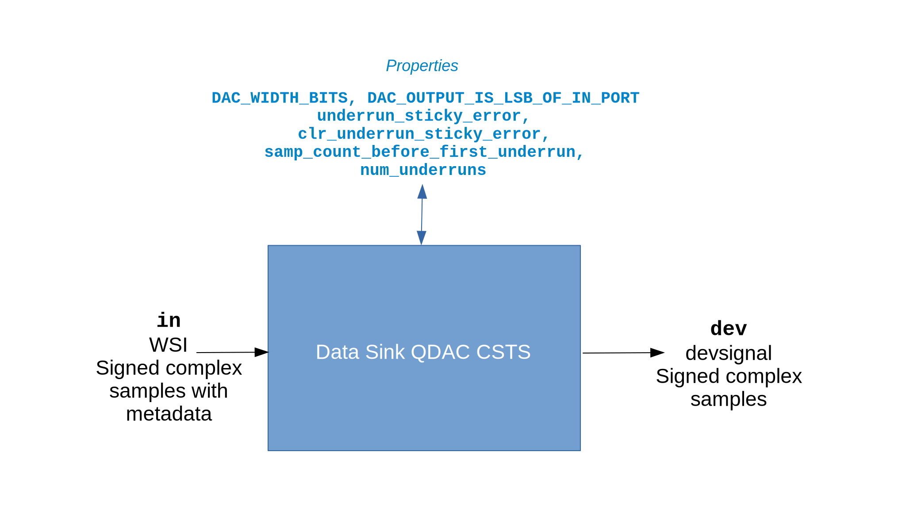

.. data_sink_qdac_csts documentation

.. This file is protected by Copyright. Please refer to the COPYRIGHT file
   distributed with this source distribution.

   This file is part of OpenCPI <http://www.opencpi.org>

   OpenCPI is free software: you can redistribute it and/or modify it under the
   terms of the GNU Lesser General Public License as published by the Free
   Software Foundation, either version 3 of the License, or (at your option) any
   later version.

   OpenCPI is distributed in the hope that it will be useful, but WITHOUT ANY
   WARRANTY; without even the implied warranty of MERCHANTABILITY or FITNESS FOR
   A PARTICULAR PURPOSE. See the GNU Lesser General Public License for
   more details.

   You should have received a copy of the GNU Lesser General Public License
   along with this program. If not, see <http://www.gnu.org/licenses/>.
   
.. _data_sink_qdac_csts:

Data Sink QDAC CSTS (``data_sink_qdac_csts``)
=============================================
Provides HDL device worker functionality common to all DAC devices.
``data_sink_qdac_csts`` is an asset in the ``ocpi.platform.devices`` component library.
Implementations include the
:ref:`data_sink_qdac_csts-HDL-worker` (``data_sink_qdac_csts.hdl``).
Tested platforms include ``xsim``.

Design
------

.. note::
   This component is functionally equivalent to the data sink QDAC component except that it specifies the Complex Short Timed Sample (CSTS) protocol in component port definitions instead of the Complex Short With Metadata (CSWM) protocol. The CSTS version of this component will replace the CSWM version in a future release.

The data sink Quadratic Digital-to-Analog-Converter (QDAC) CSTS component provides the properties
and ports necessary for its HDL device worker implementation, which provides the
functionality that is common to all Digital-to-Analog Converter (DAC) device types.
This functionality includes:

* Interpreting input messages indicating end of data and finishing on end-of-file (EOF)

* Normalizing input data to the bit width of the device

* Providing an underrun indicator when the rate of input data is less than the DAC data rate

The data sink QDAC CSTS HDL device worker implementation is intended to be paired with
an HDL subdevice worker that translates the ``dev`` interface
to a device-specific interface.

A block diagram representation of the component is given in :numref:`data_sink_qdac_csts-diagram`

.. _data_sink_qdac_csts-diagram:

   Data Sink QDAC CSTS Component Block Diagram

.. note:: 
   In the figure above, "WSI" refers to the Worker Streaming Interface, which is described in the `OpenCPI HDL Development Guide <https://opencpi.gitlab.io/releases/latest/docs/OpenCPI_HDL_Development_Guide.pdf>`_.
   
Interface
---------
.. literalinclude:: ../specs/data_sink_qdac_csts-spec.xml
   :language: xml

Properties
~~~~~~~~~~
.. ocpi_documentation_properties::

Ports
~~~~~
.. ocpi_documentation_ports::

Implementations
---------------
.. ocpi_documentation_implementations:: ../data_sink_qdac_csts.hdl

Example Application
-------------------
To be supplied: a meaningful example for this HDL device worker.

.. literalinclude:: example_app.xml
   :language: xml

Dependencies
------------
The dependencies to other elements in OpenCPI are:

 * None.

Limitations
-----------
Limitations of ``data_sink_qdac_csts`` are:

 * None.

Testing
-------
This component test suite uses the OpenCPI unit test framework, which uses a device emulator
worker for verification.  The device emulator worker produces clocks of varying frequency
from ``1e6`` to ``200e6`` Hz which are forwarded to the ``dev`` port of the unit under test.
The unit test checks that the input file and output file
match and that no expected underruns occurred during the test.

.. ocpi_documentation_test_platforms::

.. ocpi_documentation_test_result_summary::
