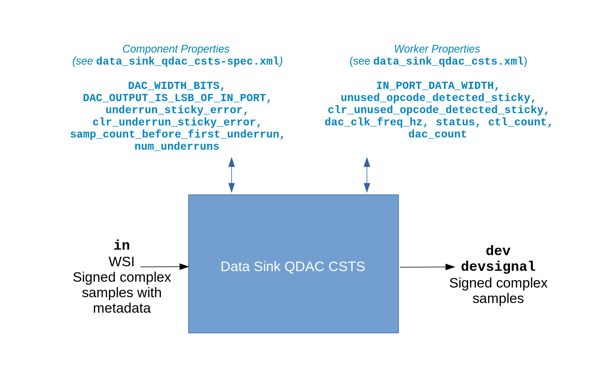

.. data_sink_qdac_csts HDL worker

.. This file is protected by Copyright. Please refer to the COPYRIGHT file
   distributed with this source distribution.

   This file is part of OpenCPI <http://www.opencpi.org>

   OpenCPI is free software: you can redistribute it and/or modify it under the
   terms of the GNU Lesser General Public License as published by the Free
   Software Foundation, either version 3 of the License, or (at your option) any
   later version.

   OpenCPI is distributed in the hope that it will be useful, but WITHOUT ANY
   WARRANTY; without even the implied warranty of MERCHANTABILITY or FITNESS FOR
   A PARTICULAR PURPOSE. See the GNU Lesser General Public License for
   more details.

   You should have received a copy of the GNU Lesser General Public License
   along with this program. If not, see <http://www.gnu.org/licenses/>.

.. _data_sink_qdac_csts-HDL-worker:

``data_sink_qdac_csts`` HDL Device Worker
=========================================
HDL device worker implementation providing common functionality to all DAC device types.

Detail
------
.. note::
   This HDL device worker is functionally equivalent to the data sink QDAC HDL device worker except that it specifies the Complex Short Timed Sample (CSTS) protocol in port definitions instead of the Complex Short With Metadata (CSWM) protocol. The CSTS version of this worker will replace the CSWM version in a future release.

A block diagram representation of the HDL device worker implementation is given in :numref:`data_sink_qdac_csts-worker-diagram`

.. _data_sink_qdac_csts-worker-diagram:

   Data Sink QDAC CSTS HDL Device Worker Block Diagram

Be sure to check the ``samp_count_before_first_underrun`` and ``num_underruns`` properties
at the end of an application run because they are not stable until that time.  The worker does not use
clock domain crossing (cdc) HDL primitive library circuits
for these properties because it takes
advantage of the fact that they will have a stable value by the time the OpenCPI control
plane reads them at the end of an application run.

.. ocpi_documentation_worker::

   in: Size defined by ``IN_PORT_DATA_WIDTH``.
   on_off: See the section "Streaming Data Interfaces to/from an HDL Worker" in the `OpenCPI HDL Development Guide <https://opencpi.gitlab.io/releases/latest/docs/OpenCPI_HDL_Development_Guide.pdf>`_ for instructions on calculating the default value.

Utilization
-----------
.. ocpi_documentation_utilization::
