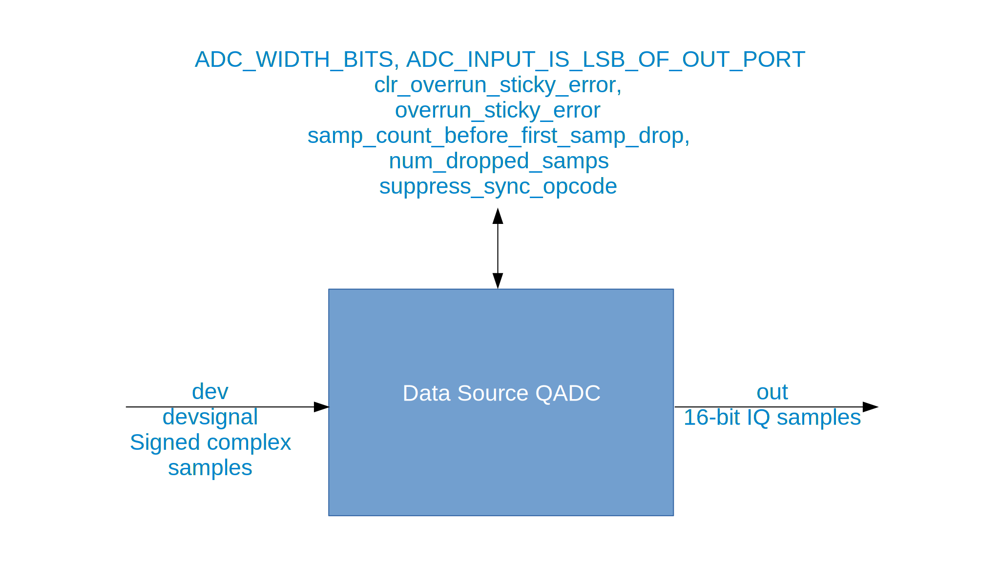

.. data_src_qadc documentation

.. This file is protected by Copyright. Please refer to the COPYRIGHT file
   distributed with this source distribution.

   This file is part of OpenCPI <http://www.opencpi.org>

   OpenCPI is free software: you can redistribute it and/or modify it under the
   terms of the GNU Lesser General Public License as published by the Free
   Software Foundation, either version 3 of the License, or (at your option) any
   later version.

   OpenCPI is distributed in the hope that it will be useful, but WITHOUT ANY
   WARRANTY; without even the implied warranty of MERCHANTABILITY or FITNESS FOR
   A PARTICULAR PURPOSE. See the GNU Lesser General Public License for
   more details.

   You should have received a copy of the GNU Lesser General Public License
   along with this program. If not, see <http://www.gnu.org/licenses/>.

.. _data_src_qadc:

Data Source QADC (``data_src_qadc``)
====================================
Provides HDL device worker functionality common to all ADC devices.
``data_src_qadc`` is an asset in the ``ocpi.platform.devices`` component library.
Implementations include the
:ref:`data_src_qadc-HDL-worker` (``data_src_qadc.hdl``).
Tested platforms include ``xsim`` (Vivado 2017.1).

Design
------
The data source Quad Analog-to-Digital Converter (QADC) component provides the
property and port definitions necessary for the data source QADC HDL device worker,
which performs all the generic functionality required to ingest ADC data onto an FPGA.

A block diagram representation of the implementation is given in :numref:`data_src_qadc-diagram`

.. _data_src_qadc-diagram:

   Block diagram of data source QADC implementation.

Interface
---------
.. literalinclude:: ../specs/data_src_qadc-spec.xml
   :language: xml

Opcode Handling
~~~~~~~~~~~~~~~
To be supplied: Description of how the non-stream opcodes are handled.

Properties
~~~~~~~~~~
.. ocpi_documentation_properties::

Ports
~~~~~
.. ocpi_documentation_ports::

Implementations
---------------
.. ocpi_documentation_implementations:: ../data_src_qadc.hdl

Example Application
-------------------
To be supplied: a meaningful example for this HDL device worker. Is the test app a candidate?

.. literalinclude:: example_app.xml
   :language: xml

Dependencies
------------
The dependencies on other elements in OpenCPI are:

 * None.

Limitations
-----------
Limitations of ``data_src_qadc`` are:

 * None.

Testing
-------
This component does not have a component unit test suite.  However, an application (which is *not* a unit test) exists for testing purposes.  See ``platform/applications/data_src_adc_ext.test_app``.

.. ocpi_documentation_test_result_summary::
