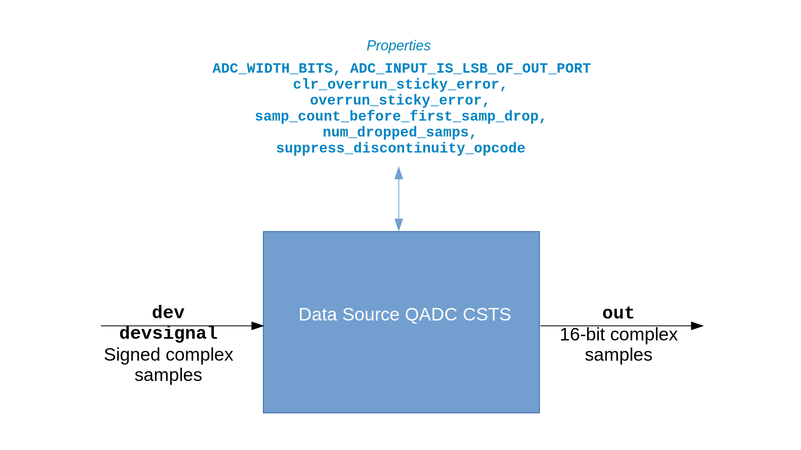

.. data_src_qadc_csts documentation

.. This file is protected by Copyright. Please refer to the COPYRIGHT file
   distributed with this source distribution.

   This file is part of OpenCPI <http://www.opencpi.org>

   OpenCPI is free software: you can redistribute it and/or modify it under the
   terms of the GNU Lesser General Public License as published by the Free
   Software Foundation, either version 3 of the License, or (at your option) any
   later version.

   OpenCPI is distributed in the hope that it will be useful, but WITHOUT ANY
   WARRANTY; without even the implied warranty of MERCHANTABILITY or FITNESS FOR
   A PARTICULAR PURPOSE. See the GNU Lesser General Public License for
   more details.

   You should have received a copy of the GNU Lesser General Public License
   along with this program. If not, see <http://www.gnu.org/licenses/>.

.. _data_src_qadc_csts:

Data Source QADC CSTS (``data_src_qadc_csts``)
==============================================
Provides HDL device worker functionality common to all ADC devices.
``data_src_qadc_csts`` is an asset in the ``ocpi.platform.devices`` component library.
Implementations include the
:ref:`data_src_qadc_csts-HDL-worker` (``data_src_qadc_csts.hdl``).
Tested platforms include ``xsim`` (Vivado 2017.1).

Design
------
.. note::
   This component is functionally equivalent to the data source QADC component except that it specifies the Complex Short Timed Sample (CSTS) protocol in component port definitions instead of the Complex Short With Metadata (CSWM) protocol. The CSTS version of this component will replace the CSWM version in a future release.

The data source Quadratic Analog-to-Digital Converter (QADC) CSTS component provides the
property and port definitions necessary for the data source QADC CSTS HDL device worker,
which performs all the generic functionality required to ingest ADC data onto an FPGA.

A block diagram representation of the implementation is given in :numref:`data_src_qadc_csts-diagram`

.. _data_src_qadc_csts-diagram:

   Data Source QADC CSTS Block Diagram

Interface
---------
.. literalinclude:: ../specs/data_src_qadc_csts-spec.xml
   :language: xml

Properties
~~~~~~~~~~
.. ocpi_documentation_properties::

Ports
~~~~~
.. ocpi_documentation_ports::

Implementations
---------------
.. ocpi_documentation_implementations:: ../data_src_qadc_csts.hdl

Example Application
-------------------
To be supplied: a meaningful example for this HDL device worker. Is the test app a candidate?

.. literalinclude:: example_app.xml
   :language: xml

Dependencies
------------
The dependencies on other elements in OpenCPI are:

 * None.

Limitations
-----------
Limitations of ``data_src_qadc_csts`` are:

 * None.

Testing
-------
This component does not have a component unit test suite.  However, an application (which is *not* a unit test) exists for testing purposes.  See ``platform/applications/data_src_adc_ext.test_app``.

.. ocpi_documentation_test_platforms::

.. ocpi_documentation_test_result_summary::
