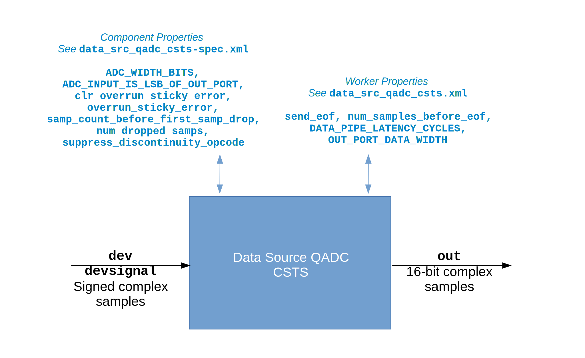

.. data_src_qadc_csts HDL worker

.. This file is protected by Copyright. Please refer to the COPYRIGHT file
   distributed with this source distribution.

   This file is part of OpenCPI <http://www.opencpi.org>

   OpenCPI is free software: you can redistribute it and/or modify it under the
   terms of the GNU Lesser General Public License as published by the Free
   Software Foundation, either version 3 of the License, or (at your option) any
   later version.

   OpenCPI is distributed in the hope that it will be useful, but WITHOUT ANY
   WARRANTY; without even the implied warranty of MERCHANTABILITY or FITNESS FOR
   A PARTICULAR PURPOSE. See the GNU Lesser General Public License for
   more details.

   You should have received a copy of the GNU Lesser General Public License
   along with this program. If not, see <http://www.gnu.org/licenses/>.

.. _data_src_qadc_csts-HDL-worker:

``data_src_qadc_csts`` HDL Device Worker
========================================
HDL device worker implementation providing common functionality to all ADC device types.

Detail
------
.. note::
   This HDL device worker is functionally equivalent to the data source QADC HDL device worker except that it specifies the Complex Short Timed Sample (CSTS) protocol in port definitions instead of the Complex Short With Metadata (CSWM) protocol. The CSTS version of this worker will replace the CSWM version in a future release.

The data source QADC HDL device worker receives sampled data from an ADC on
its ``dev`` devsignal port.
The worker sign-extends and justifies the samples to 16-bit real, 16-bit imaginary values,
which is the standard provided by the ``samples`` argument of the
``complex_short_timed_sample-prot`` protocol used by the ``out`` port.
The HDL device worker performs justification within the 16-bit values according to
the value of the ``ADC_INPUT_IS_LSB_OF_OUT_PORT`` parameter property.

The ADC samples are sent along with the ADC clock on the ``dev`` devsignal port.
The ouput port clock is driven by the ADC clock, and backpressure from the output
port’s ready signal is not expected under normal operation. When backpressure is
experienced, the ``overrun_sticky_error`` property is set to ``true``; in this
case, an ``out`` port samples message will be ended if one is in progress, and
a sync message will be sent to the output port.

The ``samp_count_before_first_samp_drop`` component property
gives the number of samples before the first dropped sample and the
``num_dropped_samps`` component property gives the number of samples dropped.
Be sure to check these two properties
at the end of an application run because they are not stable until then.
The worker does not use clock domain crossing (cdc) HDL primitive library circuits
for these properties because it takes advantage of the fact that they will have
a stable value by the time the OpenCPI control
plane reads them at the end of an application run.

When set to ``true``, the ``suppress_discontinuity_opcode`` component property prevents the HDL device worker from
sending ``sync`` opcodes.

When set to ``true``, the ``send_eof`` worker property allows the HDL device worker to send
an EOF after the number of samples specified in the ``num_samples_before_eof`` worker property have been sent.

A block diagram representation of the HDL device worker implementation is given in :numref:`data_src_qadc_csts-worker-diagram`

.. _data_src_qadc_csts-worker-diagram:

   Data Source QADC CSTS HDL Device Worker Block Diagram

.. ocpi_documentation_worker::

   out: Sign-extended justified 16-bit complex samples

Utilization
-----------
.. ocpi_documentation_utilization::
