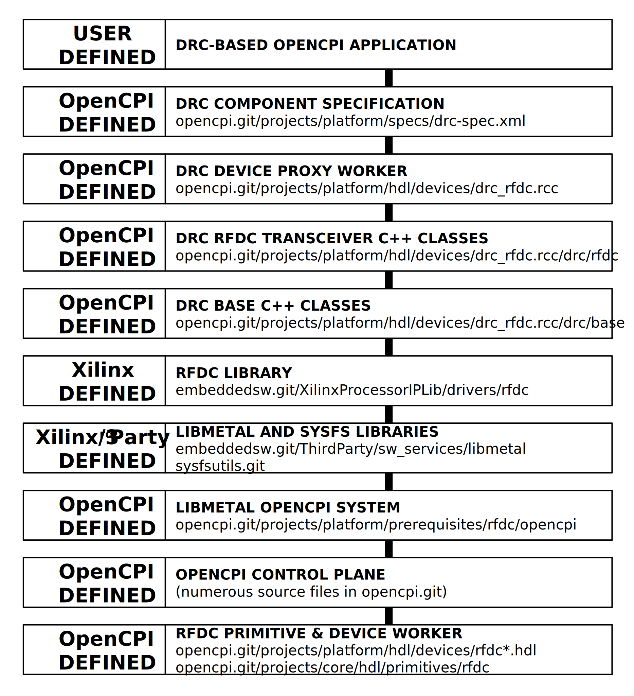

.. drc_rfdc.rcc RCC worker

.. _drc_rfdc.rcc-RCC-worker:

``drc_rfdc.rcc`` RCC Worker
===========================
Digital Radio Controller for the Xilinx RF Data Converter

Detail
------
The top-down architecture of the RF Data Converter Architecture using the Digital Radio Controller (DRC) control interface is shown below.

.. ocpi_documentation_worker::

RFDC DRC Mapping
------------------

..

+--------------------------------------+--------+------------------------------+-----------------------------------+-----------------------------------------------+
| DRC API call                         | Data   | Constraint Satisfaction      | Underlying API call (ref 1.)      | Constrained                                   |
|                                      | Stream | Problem Variable             |                                   | Range(s)                                      |
|                                      | ID     |                              |                                   |                                               |
+======================================+========+==============================+===================================+===============================================+
| RFDCDRC::set_direction()             | rx1    | rfdc_dir_rx1                 | N/A                               | 0 (rx)                                        |
+--------------------------------------+--------+------------------------------+-----------------------------------+-----------------------------------------------+
| RFDCDRC::set_direction()             | rx2    | rfdc_dir_rx2                 | N/A                               | 0 (rx)                                        |
+--------------------------------------+--------+------------------------------+-----------------------------------+-----------------------------------------------+
| RFDCDRC::set_direction()             | tx1    | rfdc_dir_tx1                 | N/A                               | 1 (tx)                                        |
+--------------------------------------+--------+------------------------------+-----------------------------------+-----------------------------------------------+
| RFDCDRC::set_direction()             | tx2    | rfdc_dir_tx2                 | N/A                               | 1 (tx)                                        |
+--------------------------------------+--------+------------------------------+-----------------------------------+-----------------------------------------------+
| RFDCDRC::set_tuning_freq_MHz()       | rx1    | rfdc_fc_meghz_rx1            |                                   | 0 (ref 2.)                                    |
+--------------------------------------+--------+------------------------------+-----------------------------------+-----------------------------------------------+
| RFDCDRC::set_tuning_freq_MHz()       | rx2    | rfdc_fc_meghz_rx2            |                                   | 0 (ref 2.)                                    |
+--------------------------------------+--------+------------------------------+-----------------------------------+-----------------------------------------------+
| RFDCDRC::set_tuning_freq_MHz()       | tx1    | rfdc_fc_meghz_tx1            |                                   | 0 (ref 2.)                                    |
+--------------------------------------+--------+------------------------------+-----------------------------------+-----------------------------------------------+
| RFDCDRC::set_tuning_freq_MHz()       | tx2    | rfdc_fc_meghz_tx2            |                                   | 0 (ref 2.)                                    |
+--------------------------------------+--------+------------------------------+-----------------------------------+-----------------------------------------------+
| RFDCDRC::set_bandwidth_3dB_MHz()     | rx1    | rfdc_bw_meghz_rx1            | N/A                               | 100 (ref 3.)                                  |
+--------------------------------------+--------+------------------------------+-----------------------------------+-----------------------------------------------+
| RFDCDRC::set_bandwidth_3dB_MHz()     | rx2    | rfdc_bw_meghz_rx2            | N/A                               | 100 (ref 3.)                                  |
+--------------------------------------+--------+------------------------------+-----------------------------------+-----------------------------------------------+
| RFDCDRC::set_bandwidth_3dB_MHz()     | tx1    | rfdc_bw_meghz_tx1            | N/A                               | 100 (ref 3.)                                  |
+--------------------------------------+--------+------------------------------+-----------------------------------+-----------------------------------------------+
| RFDCDRC::set_bandwidth_3dB_MHz()     | tx2    | rfdc_bw_meghz_tx2            | N/A                               | 100 (ref 3.)                                  |
+--------------------------------------+--------+------------------------------+-----------------------------------+-----------------------------------------------+
| RFDCDRC::set_sampling_rate_Msps()    | rx1    | rfdc_fs_megsps_rx1           | N/A                               | 100 (ref 3.)                                  |
+--------------------------------------+--------+------------------------------+-----------------------------------+-----------------------------------------------+
| RFDCDRC::set_sampling_rate_Msps()    | rx2    | rfdc_fs_megsps_rx2           | N/A                               | 100 (ref 3.)                                  |
+--------------------------------------+--------+------------------------------+-----------------------------------+-----------------------------------------------+
| RFDCDRC::set_sampling_rate_Msps()    | tx1    | rfdc_fs_megsps_tx1           | N/A                               | 100 (ref 3.)                                  |
+--------------------------------------+--------+------------------------------+-----------------------------------+-----------------------------------------------+
| RFDCDRC::set_sampling_rate_Msps()    | tx2    | rfdc_fs_megsps_tx2           | N/A                               | 100 (ref 3.)                                  |
+--------------------------------------+--------+------------------------------+-----------------------------------+-----------------------------------------------+
| RFDCDRC::set_samples_are_complex()   | rx1    | rfdc_samps_comp_rx1          | N/A                               | 1                                             |
+--------------------------------------+--------+------------------------------+-----------------------------------+-----------------------------------------------+
| RFDCDRC::set_samples_are_complex()   | rx2    | rfdc_samps_comp_rx2          | N/A                               | 1                                             |
+--------------------------------------+--------+------------------------------+-----------------------------------+-----------------------------------------------+
| RFDCDRC::set_samples_are_complex()   | tx1    | rfdc_samps_comp_tx1          | N/A                               | 1                                             |
+--------------------------------------+--------+------------------------------+-----------------------------------+-----------------------------------------------+
| RFDCDRC::set_samples_are_complex()   | tx2    | rfdc_samps_comp_tx2          | N/A                               | 1                                             |
+--------------------------------------+--------+------------------------------+-----------------------------------+-----------------------------------------------+
| RFDCDRC::set_gain_mode()             | rx1    | rfdc_gain_mode_rx1           | N/A                               | 1 (manual)                                    |
+--------------------------------------+--------+------------------------------+-----------------------------------+-----------------------------------------------+
| RFDCDRC::set_gain_mode()             | rx2    | rfdc_gain_mode_rx2           | N/A                               | 1 (manual)                                    |
+--------------------------------------+--------+------------------------------+-----------------------------------+-----------------------------------------------+
| RFDCDRC::set_gain_mode()             | tx1    | rfdc_gain_mode_tx1           | N/A                               | 1 (manual)                                    |
+--------------------------------------+--------+------------------------------+-----------------------------------+-----------------------------------------------+
| RFDCDRC::set_gain_mode()             | tx2    | rfdc_gain_mode_tx2           | N/A                               | 1 (manual)                                    |
+--------------------------------------+--------+------------------------------+-----------------------------------+-----------------------------------------------+
| RFDCDRC::set_gain_dB()               | rx1    | rfdc_gain_db_rx1             |                                   | 0 (ref 2.)                                    |
+--------------------------------------+--------+------------------------------+-----------------------------------+-----------------------------------------------+
| RFDCDRC::set_gain_dB()               | rx2    | rfdc_gain_db_rx2             |                                   | 0 (ref 2.)                                    |
+--------------------------------------+--------+------------------------------+-----------------------------------+-----------------------------------------------+
| RFDCDRC::set_gain_dB()               | tx1    | rfdc_gain_db_tx1             |                                   | 0 (ref 2.)                                    |
+--------------------------------------+--------+------------------------------+-----------------------------------+-----------------------------------------------+
| RFDCDRC::set_gain_dB()               | tx2    | rfdc_gain_db_tx2             |                                   | 0 (ref 2.)                                    |
+--------------------------------------+--------+------------------------------+-----------------------------------+-----------------------------------------------+

References:

   1. rfdc API call, unless otherwise noted

   2. This is an existing limitation of the RFDCDRC class implementation, and does not represent the limits of the underlying hardware.

   3. This is an existing limitation of the FPGA design that is built in buildtime (during Xilinx IP generation), and does not represent the limits of the underlying hardware.
