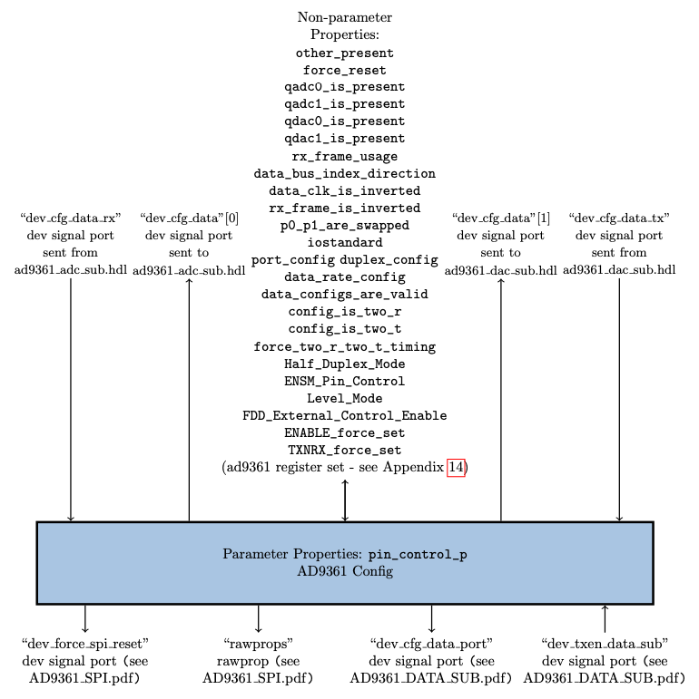

.. platform_ad9361_config documentation

.. This file is protected by Copyright. Please refer to the COPYRIGHT file
   distributed with this source distribution.

   This file is part of OpenCPI <http://www.opencpi.org>

   OpenCPI is free software: you can redistribute it and/or modify it under the
   terms of the GNU Lesser General Public License as published by the Free
   Software Foundation, either version 3 of the License, or (at your option) any
   later version.

   OpenCPI is distributed in the hope that it will be useful, but WITHOUT ANY
   WARRANTY; without even the implied warranty of MERCHANTABILITY or FITNESS FOR
   A PARTICULAR PURPOSE. See the GNU Lesser General Public License for
   more details.

   You should have received a copy of the GNU Lesser General Public License
   along with this program. If not, see <http://www.gnu.org/licenses/>.

.. meta::
   :keywords: ad9361 slave

.. _platform_ad9361_config:

AD9361 Config (``platform_ad9361_config``)
==========================================
Defines the set of properties that provides an entry point to the major functionality of the AD9361 integrated circuit (IC).
``platform_ad9361_config`` is an asset in the ``ocpi.platform.devices`` component library.
Implementations include the
:ref:`platform_ad9361_config-HDL-worker` (``platform_ad9361_config.hdl``).
Tested platforms include Agilent Zedboard/Analog Devices FMCOMMS2 (Vivado only),
Agilent Zedboard/Analog Devices FMCOMMS3 (Vivado only), x86/Xilinx ML605/Analog Devices
FMCOMMS2, x86/Xilinx ML605/Analog Devices FMCOMMS3,
Ettus E310 (Vivado only).

Design
------

This component defines the properties used by the :ref:`platform_ad9361_config-HDL-worker` HDL subdevice worker,
which provides the entry point to the major functionality of
the `AD9361 integrated circuit (IC) <https://www.analog.com/en/products/ad9361.html#>`_.
This functionality includes SPI bus functionality for intercommunication with the AD9361 register map
and command/control between the software and the FPGA.
The property definitions map to AD9361 device registers. They are specified
in the HDL subdevice worker's OpenCPI Worker Description (OWD) and not in a
separate OpenCPI Component Specification (OCS).

Note that while this HDL subdevice worker performs the register address decoding,
the SPI state machine itself is implemented in one or more separate,
platform-specific or card-specific subdevice workers.
The AD9361 config HDL subdevice worker’s register map provides an API for integrating
with the `No-OS software library <https://wiki.analog.com/resources/eval/user-guides/ad-fmcomms2-ebz/software/no-os-functions>`_
implemented by the :ref:`platform_ad9361_config_proxy-RCC-worker`.

A block diagram representation of the implementation is given in :numref:`platform_ad9361_config-diagram`

.. _platform_ad9361_config-diagram:

   AD9361 Config HDL Subdevice Worker Block Diagram

Interface
---------
This component's specification is contained in the OpenCPI Worker Description (OWD) for the HDL subdevice worker.

.. literalinclude:: ../platform_ad9361_config.hdl/platform_ad9361_config.xml
   :language: xml

Properties
~~~~~~~~~~
.. comment out ocpi_documentation_properties for now. It doesn't work.

Ports
~~~~~
.. comment out ocpi_documentation_ports directive for now. It doesn't work and there aren't any ports for this component.

Implementations
---------------
.. ocpi_documentation_implementations:: ../platform_ad9361_config.hdl

Example Application
-------------------
To be supplied: a meaningful example, if relevant to this type of worker.

.. literalinclude:: example_app.xml
   :language: xml

Dependencies
------------
.. not sure I should be listing these assets here.
   
The dependencies on other elements in OpenCPI are:

 * :ref:`platform_ad9361_config_proxy`

 * :ref:`platform_ad9361_data_sub`

 * :ref:`platform_ad9361_spi`

Limitations
-----------
Limitations of ``platform_ad9361_config`` are:

 * None.

Testing
-------
There is currently no unit test for this component.
However, the ``platform_ad9361_data_sub`` component unit test includes validation
of a subset of this HDL subdevice worker implementation's functionality (for LVDS only).

.. ocpi_documentation_test_result_summary::
