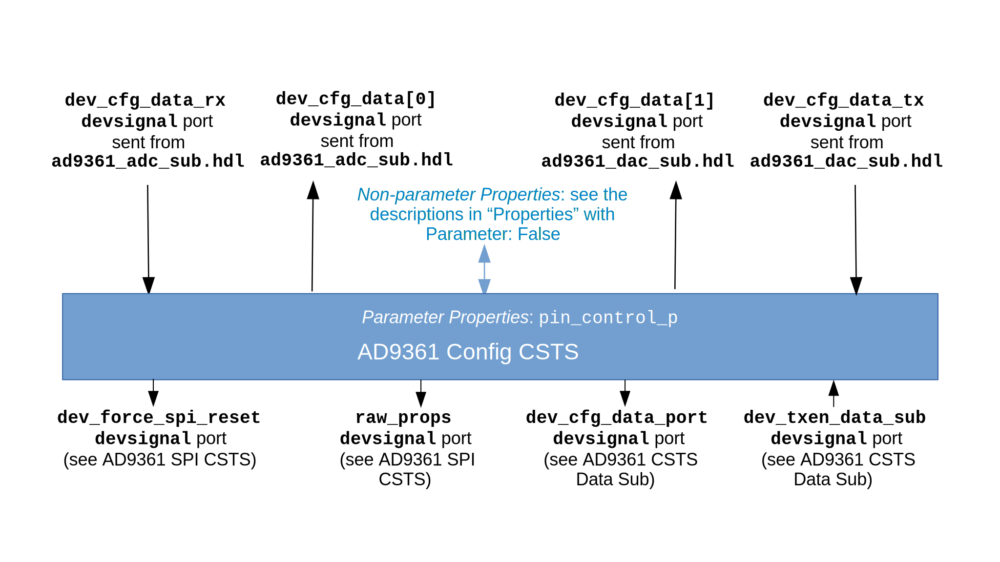

.. platform_ad9361_config_csts documentation

.. This file is protected by Copyright. Please refer to the COPYRIGHT file
   distributed with this source distribution.

   This file is part of OpenCPI <http://www.opencpi.org>

   OpenCPI is free software: you can redistribute it and/or modify it under the
   terms of the GNU Lesser General Public License as published by the Free
   Software Foundation, either version 3 of the License, or (at your option) any
   later version.

   OpenCPI is distributed in the hope that it will be useful, but WITHOUT ANY
   WARRANTY; without even the implied warranty of MERCHANTABILITY or FITNESS FOR
   A PARTICULAR PURPOSE. See the GNU Lesser General Public License for
   more details.

   You should have received a copy of the GNU Lesser General Public License
   along with this program. If not, see <http://www.gnu.org/licenses/>.

.. meta::
   :keywords: ad9361 csts slave

.. _platform_ad9361_config_csts:

AD9361 Config CSTS (``platform_ad9361_config_csts``)
====================================================

Defines the set of properties that provides an entry point to the major functionality of the AD9361 integrated circuit (IC).
``platform_ad9361_config_csts`` is an asset in the ``ocpi.platform.devices`` component library.
Implementations include the
:ref:`platform_ad9361_config_csts-HDL-worker` (``platform_ad9361_config_csts.hdl``).
Tested platforms include Agilent Zedboard/Analog Devices FMCOMMS2 (Vivado only),
Agilent Zedboard/Analog Devices FMCOMMS3 (Vivado only), x86/Xilinx ML605/Analog Devices
FMCOMMS2, x86/Xilinx ML605/Analog Devices FMCOMMS3,
Ettus E310 (Vivado only).

Design
------
.. note::
   This component is functionally equivalent to the AD9361 Config component except that it specifies the Complex Short Timed Sample (CSTS) protocol in component port definitions instead of the Complex Short With Metadata (CSWM) protocol. The CSTS version of this component will replace the CSWM version in a future release.

This component defines the properties used by the :ref:`platform_ad9361_config_csts-HDL-worker` HDL subdevice worker,
which provides the entry point to the major functionality of
the `AD9361 integrated circuit (IC) <https://www.analog.com/en/products/ad9361.html#>`_.
This functionality includes SPI bus functionality for intercommunication with the AD9361 register map
and command/control between the software and the FPGA.
The property definitions map to AD9361 device registers. They are specified
in the HDL subdevice worker's OpenCPI Worker Description (OWD) and not in a
separate OpenCPI Component Specification (OCS).

Note that while this HDL subdevice worker performs the register address decoding,
the SPI state machine itself is implemented in one or more separate,
platform-specific or card-specific subdevice workers.
The AD9361 config HDL subdevice worker’s register map provides an API for integrating
with the `No-OS software library <https://wiki.analog.com/resources/eval/user-guides/ad-fmcomms2-ebz/software/no-os-functions>`_
implemented by the :ref:`platform_ad9361_config_proxy_csts-RCC-worker`.

A block diagram representation of the implementation is given in :numref:`platform_ad9361_config_csts-diagram`

.. _platform_ad9361_config_csts-diagram:

   AD9361 Config CSTS HDL Subdevice Worker Block Diagram

Interface
---------
This component's specification is contained in the OpenCPI Worker Description (OWD) for the HDL subdevice worker.

.. literalinclude:: ../platform_ad9361_config_csts.hdl/platform_ad9361_config_csts.xml
   :language: xml

Properties
~~~~~~~~~~
.. note::
   References to table numbers in this section correspond to table numbers in the `AD9361 Register Map Reference Manual <https://usermanual.wiki/Document/AD9361RegisterMapReferenceManualUG671.1082447504/view>`_.

.. ocpi_documentation_properties::
   
      data_bus_index_direction: Set to ``1`` if the bus indexing the P0_D and P1_D was reversed before processing.
   rx_frame_usage: Set to ``1`` to indicate that this worker was built with the assumption that the RX frame operates in its toggle setting and set to ``0`` if this worker was built with the assumption that the RX frame has a rising edge on the first sample and then stays high.  The value is intended to match the AD9361 register 0x010 BIT D3.
   rx_frame_is_inverted: RX path-specific data port configuration.  Used to tell other workers about the configuration that was enforced when this worker was compiled.
   config_is_two_t: Some data port configurations, like LVDS, require the TX bus to use 2R2T timing if either 2 TX or 2 RX channels are used.  For example, if using LVDS and this has a value of 1, 2R2T timing will be forced.
   force_two_r_two_t_timing: Expected to match AD9361 register 0x010 bit D2.

Ports
~~~~~
.. ocpi_documentation_ports::

Implementations
---------------
.. ocpi_documentation_implementations:: ../platform_ad9361_config_csts.hdl

Example Application
-------------------
To be supplied: a meaningful example, if relevant to this type of worker.

.. literalinclude:: example_app.xml
   :language: xml

Dependencies
------------

.. not sure I should be listing these assets here.
   
The dependencies on other elements in OpenCPI are:

 * :ref:`platform_ad9361_config_proxy_csts`

 * :ref:`platform_csts_ad9361_data_sub`

 * :ref:`platform_ad9361_spi_csts`

Limitations
-----------
Limitations of ``platform_ad9361_config_csts`` are:

 * None.

Testing
-------
.. ocpi_documentation_test_platforms::

.. ocpi_documentation_test_result_summary::
