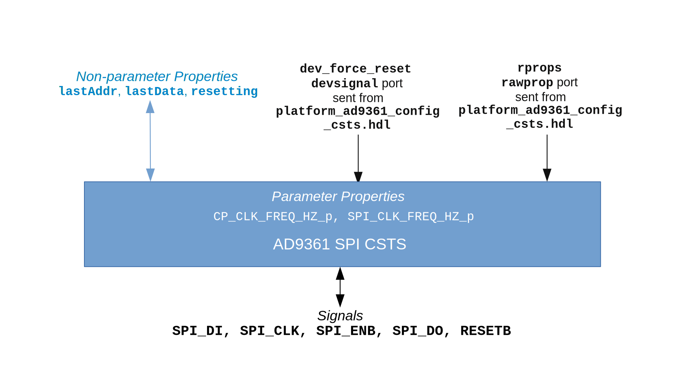

.. platform_ad9361_spi_csts documentation

.. This file is protected by Copyright. Please refer to the COPYRIGHT file
   distributed with this source distribution.

   This file is part of OpenCPI <http://www.opencpi.org>

   OpenCPI is free software: you can redistribute it and/or modify it under the
   terms of the GNU Lesser General Public License as published by the Free
   Software Foundation, either version 3 of the License, or (at your option) any
   later version.

   OpenCPI is distributed in the hope that it will be useful, but WITHOUT ANY
   WARRANTY; without even the implied warranty of MERCHANTABILITY or FITNESS FOR
   A PARTICULAR PURPOSE. See the GNU Lesser General Public License for
   more details.

   You should have received a copy of the GNU Lesser General Public License
   along with this program. If not, see <http://www.gnu.org/licenses/>.

   .. meta::
   :keywords: ad9361 spi csts

.. _platform_ad9361_spi_csts:

AD9361 SPI CSTS (``platform_ad9361_spi_csts``)
==============================================
Defines properties for implementing an SPI state machine
for communication with the AD9361 integrated circuit.
``platform_ad9361_spi_csts`` is an asset in the ``ocpi.platform.devices`` component library.
Implementations include the
:ref:`platform_ad9361_spi_csts-HDL-worker` (``platform_ad9361_spi_csts.hdl``).
Tested platforms include ML605 (FMC LPC slot), Zedboard (Vivado).

Design
------

.. note::
   This component is functionally equivalent to the AD9361 SPI component except that it specifies the Complex Short Timed Sample (CSTS) protocol in component port definitions instead of the Complex Short With Metadata (CSWM) protocol. The CSTS version of this component will replace the CSWM version in a future release.

This component defines the properties used by the :ref:`platform_ad9361_spi_csts-HDL-worker`,
which implements a serial peripheral interface (SPI) state machine for communication with
the `AD9361 integrated circuit (IC) <https://www.analog.com/en/products/ad9361.html#>`_.

A block diagram representation of the implementation is given in :numref:`platform_ad9361_spi_csts-diagram`

.. _platform_ad9361_spi_csts-diagram:

   AD9361 SPI HDL Subdevice Worker Block Diagram

Interface
---------
This component's specification is contained in the OpenCPI Worker Description (OWD) for the HDL subdevice worker.

.. literalinclude:: ../platform_ad9361_spi_csts.hdl/platform_ad9361_spi_csts.xml
   :language: xml

Properties
~~~~~~~~~~
.. ocpi_documentation_properties::

Ports
~~~~~
.. ocpi_documentation_ports::

Implementations
---------------
.. ocpi_documentation_implementations:: ../platform_ad9361_spi_csts.hdl

Example Application
-------------------
To be supplied: a meaningful example, if relevant to this type of worker.

.. literalinclude:: example_app.xml
   :language: xml

Dependencies
------------
.. not sure I should be listing these assets here.
   
The dependencies on other elements in OpenCPI are:

 * :ref:`platform_ad9361_config_proxy_csts`

 * :ref:`platform_csts_ad9361_data_sub`

 * :ref:`platform_ad9361_config_csts`

Limitations
-----------
Limitations of ``platform_ad9361_spi_csts`` are:

 * None.

Testing
-------
The test outlined in the `AD9361 DAC <https://opencpi.gitlab.io/releases/develop/docs/assets/AD9361_DAC.pdf>`_ component description (see ``ocpi.assets.devices``) includes validation of a subset of this worker’s functionality.

.. ocpi_documentation_test_result_summary::
