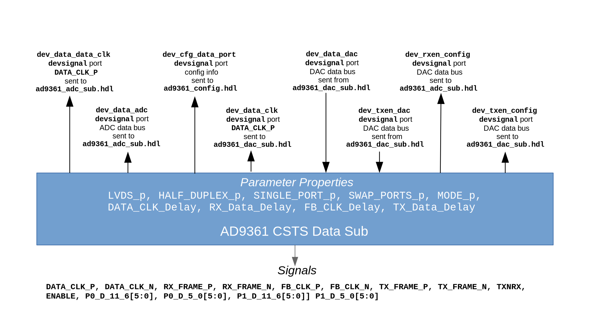

.. platform_csts_ad9361_data_sub documentation

.. This file is protected by Copyright. Please refer to the COPYRIGHT file
   distributed with this source distribution.

   This file is part of OpenCPI <http://www.opencpi.org>

   OpenCPI is free software: you can redistribute it and/or modify it under the
   terms of the GNU Lesser General Public License as published by the Free
   Software Foundation, either version 3 of the License, or (at your option) any
   later version.

   OpenCPI is distributed in the hope that it will be useful, but WITHOUT ANY
   WARRANTY; without even the implied warranty of MERCHANTABILITY or FITNESS FOR
   A PARTICULAR PURPOSE. See the GNU Lesser General Public License for
   more details.

   You should have received a copy of the GNU Lesser General Public License
   along with this program. If not, see <http://www.gnu.org/licenses/>.

.. meta::
   :keywords: ad9361 csts data sub

.. _platform_csts_ad9361_data_sub:

AD9361 CSTS Data Sub (``platform_csts_ad9361_data_sub``)
========================================================
Defines the build configuration parameters
for the AD9361 data pin interface configurations.
``platform_csts_ad9361_data_sub`` is an asset in the ``ocpi.platform.devices`` component library.
Implementations include the
:ref:`platform_csts_ad9361_data_sub-HDL-worker` (``platform_csts_ad9361_data_sub.hdl``).
Tested platforms include Agilent Zedboard/Analog Devices FMCOMMS2,
Agilent Zedboard/Analog Devices FMCOMMS3, x86/Xilinx ML605/Analog Devices
FMCOMMS2, x86/Xilinx ML605/Analog Devices FMCOMMS3,
Ettus E310 (Vivado only).

Design
------
.. note::
   This component is functionally equivalent to the AD9361 Data Sub component except that it specifies the Complex Short Timed Sample (CSTS) protocol in component port definitions instead of the Complex Short With Metadata (CSWM) protocol. The CSTS version of this component will replace the CSWM version in a future release.

This component defines the build-time configuration parameter
properties used by the :ref:`platform_csts_ad9361_data_sub-HDL-worker` HDL subdevice worker,
which interfaces with the AD9361 device's ``DATA_CLK_P``/ ``DATA_CLK_N``, ``P0_D[11:0]``,
``P1_D[11:0]``, ``RX_FRAME_P``, ``RX_FRAME_N``, ``TX_FRAME_P``,
``TX_FRAME_N``, ``TXNRX``, and ``ENABLE`` pins.

The ``P0_D`` and ``P1_D`` pins are routed to the HDL subdevice worker
that is appropriate for the given AD9361 data pin interface configuration
(``ad9361_adc_sub.hdl`` or ``ad9361_dac_sub.hdl``; see ``../projects/assets/hdl/devices/``).

A block diagram representation of the implementation is given in :numref:`platform_csts_ad9361_data_sub-diagram`

.. _platform_csts_ad9361_data_sub-diagram:

   AD9361 CSTS Data Sub HDL Subdevice Worker Block Diagram

Interface
---------
This component's specification is contained in the OpenCPI Worker Description (OWD) for the HDL subdevice worker.

.. literalinclude:: ../platform_csts_ad9361_data_sub.hdl/platform_csts_ad9361_data_sub.xml
   :language: xml

Properties
~~~~~~~~~~
.. ocpi_documentation_properties::

Ports
~~~~~
.. ocpi_documentation_ports::

Implementations
---------------
.. ocpi_documentation_implementations:: ../platform_csts_ad9361_data_sub.hdl

Example Application
-------------------
To be supplied: a meaningful example, if relevant to this type of worker.

.. literalinclude:: example_app.xml
   :language: xml

Dependencies
------------
The dependencies on other elements in OpenCPI are:

.. not sure I should be listing these assets here.
   
 * :ref:`platform_ad9361_config_proxy_csts`

 * :ref:`platform_ad9361_config_csts`

 * :ref:`platform_ad9361_spi_csts`

Limitations
-----------
Limitations of ``platform_csts_ad9361_data_sub`` are:

 * None.

Testing
-------
The test outlined in the
`AD9361 DAC <https://opencpi.gitlab.io/releases/develop/docs/assets/AD9361_DAC.pdf>`_
component description (see ``ocpi.assets.devices``)
includes validation of this worker’s functionality (for LVDS mode and CMOS Single Port Full Duplex DDR mode).

.. ocpi_documentation_test_platforms::

.. ocpi_documentation_test_result_summary::
