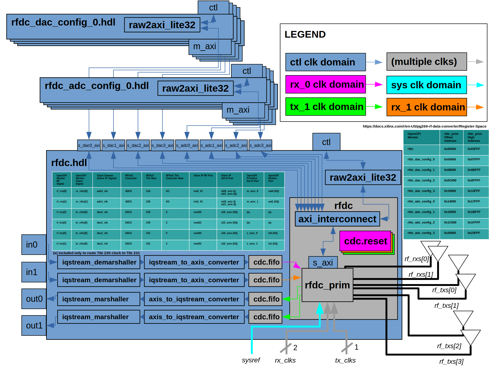

.. rfdc.hdl HDL worker

.. _rfdc.hdl-HDL-worker:

``rfdc.hdl`` Worker
======================
Xilinx RF Data Converter Device Worker.

Description
------
For a full top-down description of the RF Data Converter Architecture, see the drc_rfdc.rcc worker documentation.

.. ocpi_documentation_worker::

The Xilinx RF Data Converter (RFDC) has 3 generations (https://www.xilinx.com/products/intellectual-property/rf-data-converter.html). The following is a non-comprehensive list of capabilities:

#. Number of RF ADCs range from 0 to 16 (generation-dependent)
#. Number of RF DACs range from 0 to 16 (generation-dependent)
#. ADC number of sample bits ranges from 12 bits to 14 bits (generation-dependent)
#. DAC number of sample bits is 14
#. ADC RF direction conversion sampling rates vary and are up to 5.9 Gsps (generation-dependent) and are specified at build-time by the IP generator GUI
#. DAC RF direction conversion sampling rates vary and are up to 10 Gsps (generation-dependent) and are specified at build-time by the IP generator GUI
#. Digital decimation/interpolation rates range from 1x to 40x (generation-dependent)
#. Clock source/routing is complicated and the Xilinx IP generator GUI indicates valid/invalid configurations
#. ADCs and DACs are organized by tiles in a manner that adds complexity

Build Configurations
------

This worker and its underlying rfdc primitive only support the following RFDC configuration(s):

* config 0

  * Generation 3 ZU48DR (xczu48dr-ffvg1517-2-e)
  * 2 ADCs (Tiles 224, 226)
  * 2 DACs (Tile 231)
  * 14-bit ADC
  * 14-bit DAC
  * ADC RF direction conversion sampling rate of 4 Gsps
  * DAC RF direction conversion sampling rate of 4 Gsps
  * Digital decimation/interpolation rate of 40x (4 Gsps / 40 = 100 Msps at AXI-Stream ports)
  * Digital complex mixer (fine frequency control) enabled for every converter

Design Philosophy
------

This worker was designed with the following ordered design priorities:

#. Enable the RF Data Converter (RFDC) HiTechGlobal ZU48DR variant with J3, J13, J18, J20 (Tiles 224, 226, 231) RF connectors
#. Instance as few RFDC Xilinx IP RF ports as possible
#. Instance as few RFDC clocks as possible

The rfdc.hdl worker contains a fixed number of WSI ports according to the previously mentioned ADC/DAC configuration(s). Future support for additional configuration(s) require detailed investigation of the common functionality, especially the clock configuration, and incorporating additional parameter properties (and mapping them to underlying rfdc primitive VHDL generics) and OpenCPI ports in the worker's component specification (and mapping them to underlying rfdc primitive AXI-Stream ports), and enabling the parameter-controlled configuration via a worker build.xml.

AXI-Lite Register Access
------

The permissible address space per OpenCPI HDL worker is undocumented. Because runtime exceptions were occuring when putting all possible Xilinx RFDC IP registers within the rfdc.hdl worker's property space, the IP address space was segmented in 16 KB segments across the following workers according to a similar segmentation within the IP itself:

* rfdc.hdl
* rfdc_dac_config_0.hdl
* rfdc_dac_config_1.hdl
* rfdc_dac_config_2.hdl
* rfdc_dac_config_3.hdl
* rfdc_adc_config_0.hdl
* rfdc_adc_config_1.hdl
* rfdc_adc_config_2.hdl
* rfdc_adc_config_3.hdl

The overarching software in drc_rfdc.rcc knows about this segmentation and forwards each libmetal register access to the proper HDL worker.

``rfdc`` HDL Primitive
======================
The primitive consists of a Makefile, Vivado TCL script, and a VHDL wrapper module and corresponding VHDL package. The following build steps are performed:

#. Create Xilinx Managed IP Project ("a special project for managing customizations and output products of specified IP" (https://docs.xilinx.com/r/en-US/ug896-vivado-ip/Using-Manage-IP-Projects) which is well-suited to wrapping Xilinx IP in OpenCPI HDL primitives).
#. Instance the Xilinx RF Data Converter IP
#. Configure the Xilinx IP as previously mentioned
#. Export Xilinx IP instantiation templates
#. Perform synthesis (this was found to be necessary in order to properly propagate IP-generated constraint files all the way to the OpenCPI HDL assembly build)
#. Export (to the OpenCPI target directory) a) the synthesis output as a .edf file, b) the VHDL wrapper module source file, and c) the VHDL package source file.

The generic_pcie primitive was used as an example for Xilinx IP managed project creation and synthesis. 
The rfdc primitive contains a fixed number of AXI-Stream ports according to the previously mentioned configuration(s). Future support for additional configuration(s) require detailed investigation of the common functionality, especially the clock configuration, and incorporating additional VHDL generics and/or AXI-Stream ports in the rfdc primitive.
The rfdc primitive instances a custom AXI-Lite interconnect that properly forwards the worker-segmented property spaces to the single AXI-Lite slave interface on the Xilinx IP module.
