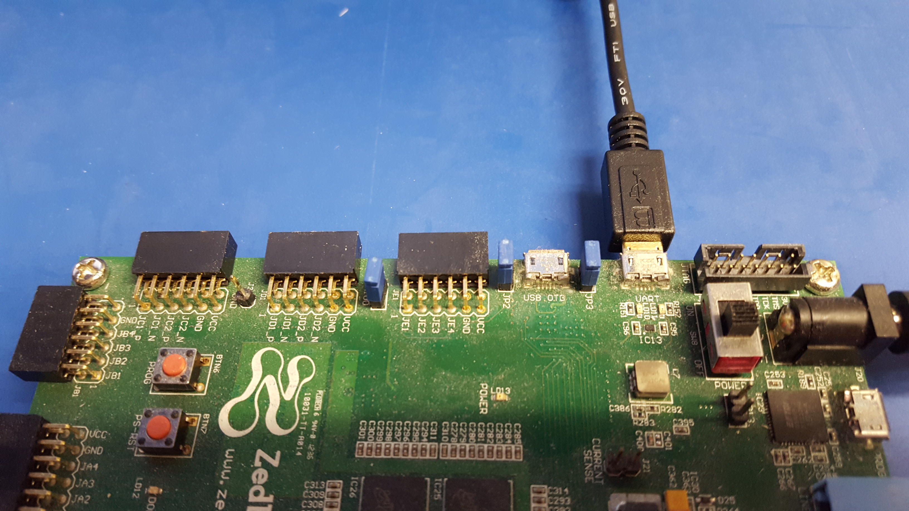
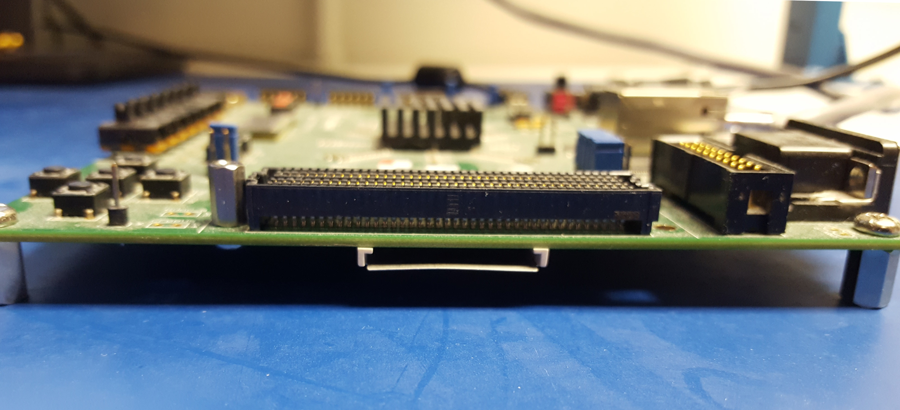
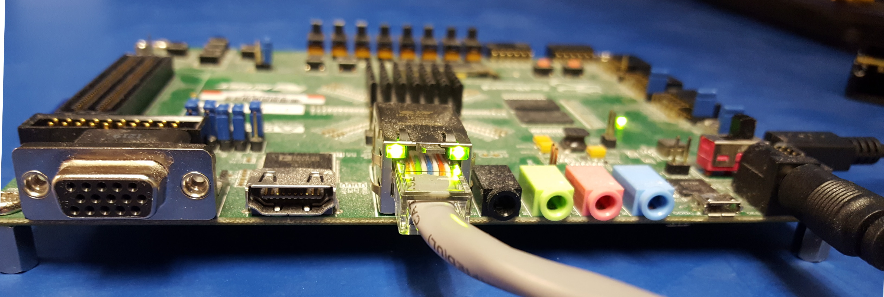
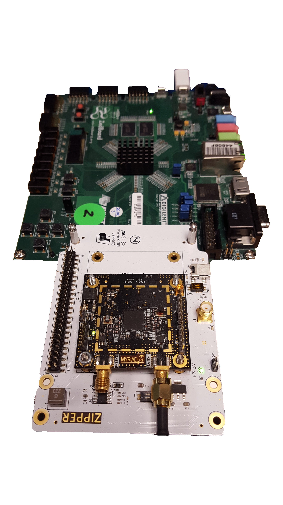

.. zed_gsg ZedBoard Getting Started Guide documentation

.. This file is protected by Copyright. Please refer to the COPYRIGHT file
   distributed with this source distribution.

   This file is part of OpenCPI <http://www.opencpi.org>

   OpenCPI is free software: you can redistribute it and/or modify it under the
   terms of the GNU Lesser General Public License as published by the Free
   Software Foundation, either version 3 of the License, or (at your option) any
   later version.

   OpenCPI is distributed in the hope that it will be useful, but WITHOUT ANY
   WARRANTY; without even the implied warranty of MERCHANTABILITY or FITNESS FOR
   A PARTICULAR PURPOSE. See the GNU Lesser General Public License for
   more details.

   You should have received a copy of the GNU Lesser General Public License
   along with this program. If not, see <http://www.gnu.org/licenses/>.

.. _zed_gsg:

ZedBoard Getting Started Guide
==============================

This document provides installation information that is specific
to the Avnet (Digilent) ZedBoard. It is intended to be used in tandem with the
`OpenCPI Installation Guide <https://opencpi.gitlab.io/releases/develop/docs/OpenCPI_Installation_Guide.pdf>`_,
which describes the general steps to enable OpenCPI for use on an embedded system.
Use this guide as a companion to the *OpenCPI Installation Guide*, especially when
performing the steps described in the chapter "Enabling OpenCPI Development
for Embedded Systems". It provides details about the ZedBoard system that
can be applied to the procedures described in that section.

The following documents can also be used as reference to the tasks described in this document:

* `OpenCPI User Guide <https://opencpi.gitlab.io/releases/develop/docs/OpenCPI_User_Guide.pdf>`_
  
* `OpenCPI Glossary <https://opencpi.gitlab.io/releases/develop/docs/OpenCPI_Glossary.pdf>`_

Note that the *OpenCPI Glossary* is also contained in both the *OpenCPI Installation Guide* and the
*OpenCPI User Guide*.

This document assumes a basic understanding of the Linux command line (or "shell") environment.

Revision History
----------------

.. csv-table:: OpenCPI ZedBoard Getting Started Guide: Revision History
   :header: "Revision", "Description of Change", "Date"
   :widths: 10,30,10
   :class: tight-table

   "v1.1", "Initial Release", "3/2017"
   "v1.2", "Updated for OpenCPI Release 1.2", "8/2017"
   "v1.3", "Updated for OpenCPI Release 1.3", "2/2018"
   "pre-v1.4", "Fixed inaccurate description for hardware jumper configuration, OpenCPI-SD-zed directory path, and MAC address modification instructions for multiple Zedboards on the same network", "4/2018"
   "v1.4", "Update descriptions and paths", "9/2018"
   "v1.5", "Deprecate Zipper", "4/2018"
   "v1.6", "Refer to Installation Guide where possible", "1/2020"
   "v2.2", "Convert to RST, update to xilinx19_2_aarch32", "4/2021"

Software Prerequisites
----------------------

As shown in the Table of Supported Platforms in the *OpenCPI Installation Guide*,
support for the ZedBoard system is based on the ``zed`` or ``zed_ise`` OpenCPI
HDL (FPGA) platform and the ``xilinx19_2_aarch32`` OpenCPI RCC (software) platform.
The ``zed`` is the default HDL platform for the ZedBoard system and
is defined to support the Xilinx Vivado tools, while the ``zed_ise`` platform
is defined to support the older Xilinx ISE tools in cases where use of these
older tools is required. The HDL platforms are supported by
the ``ocpi.platform`` built-in project, while
the RCC platforms are supported by the ``ocpi.core`` built-in project.

RCC Platforms
~~~~~~~~~~~~~

The ZedBoard system supports the RCC platform ``xilinx19_2_aarch32``, which
is also used by other systems such as the Ettus E310 (``e31x``).
If this platform has already been installed and built for another system,
it can apply to the ZedBoard and does not need to be installed and built.

Third-party/Vendor Tools
~~~~~~~~~~~~~~~~~~~~~~~~

As shown in the *OpenCPI Installation Guide* Table of Supported Platforms,
the tools used for cross compilation are from Xilinx Vitis 2019.2
and the tools used for the FPGA are any recent version
of the Xilinx Vivado WebPACK tools (``zed``) or Xilinx ISE 14.7 WebPACK (``zed_ise``).
The Xilinx Linux kernel for the ``xilinx19_2_aarch32`` RCC platform is based
on the Xilinx Linux kernel tagged ``xilinx-v2019.2``.
The chapter "Installing Third-party/Vendor Tools" in the *OpenCPI Installation Guide*
describes how to install these tools.

Build the Required OpenCPI Projects
~~~~~~~~~~~~~~~~~~~~~~~~~~~~~~~~~~~

The *OpenCPI Installation Guide* describes how to build the standard built-in OpenCPI projects.
This step results in a single executable FPGA test application named ``bias`` that is
ready to run. The ``bias`` test application is based on the ``testbias`` HDL assembly.
Both ``bias`` and ``testbias`` reside in the ``ocpi.assets`` built-in project.

Hardware Prerequisites
----------------------

The ZedBoard system requires the following hardware setup.

Zedboard Product Package
~~~~~~~~~~~~~~~~~~~~~~~~

The ZedBoard product package should include the following items:

* Power supply

* micro-USB to USB cable

* Micro-USB to female-USB adapter

* Standard SD card (4GB)

OpenCPI has been tested on Zedboard revisions C and D.

The micro-USB serial port, labeled **UART** and located on the top side of the ZedBoard,
can be used to access the serial connection with the processor.

   Connected Serial USB

The SD card slot is located below the FMC LPC slot
on the bottom side of the ZedBoard.

   ZedBoard FMC Slot and SD Card Slot

Ethernet Cable
~~~~~~~~~~~~~~

An Ethernet port is available on the ZedBoard and is required when the network mode environment
is used. The OpenCPI BSP for the ZedBoard is configured for DHCP.

   Connected Ethernet

OpenCPI ZedBoard Supported Daughtercards (Optional)
~~~~~~~~~~~~~~~~~~~~~~~~~~~~~~~~~~~~~~~~~~~~~~~~~~~

The ZedBoard has an FMC LPC slot that is used to connect plug-in modules or daughtercards.
Currently, OpenCPI supports two daughtercards that can be installed on the ZedBoard:

* Analog Devices FMCOMMS2

* Analog Devices FMCOMMS3

DHCP Support
~~~~~~~~~~~~

Using the ZedBoard system in network mode requires access to a network that supports DHCP.

SD Card Reader
~~~~~~~~~~~~~~

The ZedBoard hardware setup requires an SD card reader.

Setting up the SD Card
----------------------

The chapter "Enabling OpenCPI Development for Embedded Systems"
ein the *OpenCPI Installation Guide* provides a section "Installation
Steps for Systems after its Platforms are Installed" that describes
how to create a new SD card for OpenCPI and how to customize some
of the OpenCPI SD card files for your particular configuration.
The recommended method is to make a raw copy of the manufacturer-supplied card to
a new card, preserving formatting and content, and then remove most of the
original files and copy files from OpenCPI. If you need to format the
SD card for the ZedBoard system, it should be a single FAT32 partition.

.. _multiboards:

Setting up Multiple ZedBoards on the Same Network
-------------------------------------------------

By default, each ZedBoard released by the factory has
the same MAC address. If you require multiple ZedBoards
to be on the same network, you must edit the SD card OpenCPI
startup scripts ``mynetsetup.sh`` or ``mysetup.sh`` to provide
a unique MAC address for each ZedBoard. These scripts are created
for the ZedBoard (``zynq``) when you perform the step described
in the section "Preparing the SD Card Contents" in the
*OpenCPI Installation Guide*.

To update the SD card startup scripts, uncomment the following
lines in the  ``mynetsetup.sh`` and/or ``mysetup.sh`` scripts
and then change the Ethernet address to be unique. For example:
::
   
   # ifconfig eth0 down
   # ifconfig eth0 hw ether 00:0a:35:00:01:24
   # ifconfig eth0 up
   # udhcpc

where  ``00:0a:35:00:01:24`` is the unique MAC address for the ZedBoard.

Configuring the Runtime Environment on the Platform
---------------------------------------------------

The *OpenCPI Installation Guide* has a section
"Configuring the Runtime Environment on the Embedded System"
that describes how to set up and verify the runtime environment.
This system is initially set with
``root`` for user name and password. Typically, on initial
power-on of the platform, the boot sequence will stop at
the ``uboot`` configuration prompt. When this occurs, simply
enter ``boot`` to allow the boot sequence to continue:

.. code-block::

   $ zynq-uboot> boot

After a successful boot to PetaLinux, log in to the system
using ``root`` for user name and password:

.. figures/figure:: zed_boot.png
   :alt: Successful Boot to PetaLinux
   :align: center

   Successful Boot to PetaLinux

When a single ZedBoard is on the network, execute the following
command to enable its Ethernet interface:

.. code-block::

   $ ifconfig eth0 up

When multiple ZedBoards are on the network, you must modify
the ``mynetsetup.sh`` script according to the instructions in
:ref:`multiboards`   
before you proceed to the next step of running an application.

Running an Application
----------------------

The *OpenCPI Installation Guide* section "Running a Test Application"
describes how to run a small test application.

Using Xilinx ISE Instead of Vivado with the Zedboard
----------------------------------------------------

As described in the *OpenCPI Installation Guide*, each OpenCPI platform
depends on a set of third-party/vendor tools that need to be manually
installed so that the platform can be built. OpenCPI supports two
different FPGA/HDL platforms for the ZedBoard:

* The ``zed`` platform (HDL target ``zynq``), which is built with
  the Xilinx Vivado tools

* The ``zed_ise`` platform (HDL target ``zynq_ise``), which is
  built with the Xilinx ISE tools

If your environment requires the use of Xilinx ISE tools rather
than the (recommended) Xilinx Vivado tools, you need to target the
``zed_ise`` platform for building bitstreams for the ZedBoard,
not the ``zed`` platform.

.. include:: snippets/drivernotes.rst
   
Deprecated Zipper Daughtercard
------------------------------

As of OpenCPI Version 1.5, support for Lime Microsystems' Zipper daughtercard
is deprecated. This section contains information about this card that
has been removed from the main body of this document.

OpenCPI has been tested on revisions C and D of the ZedBoard. However,
limitations have been observed for both revisions when used with the
Zipper daughtercard. See the document
`OpenCPI Zipper/Myriad-RF 1 Daughtercards <https://opencpi.gitlab.io/releases/develop/docs/assets/Myriad-RF_1_Zipper_Limitations.pdf>`_
for details.

	   
   ZedBoard with Zipper and MyriadRF-1 Connected to the FMC Slot

