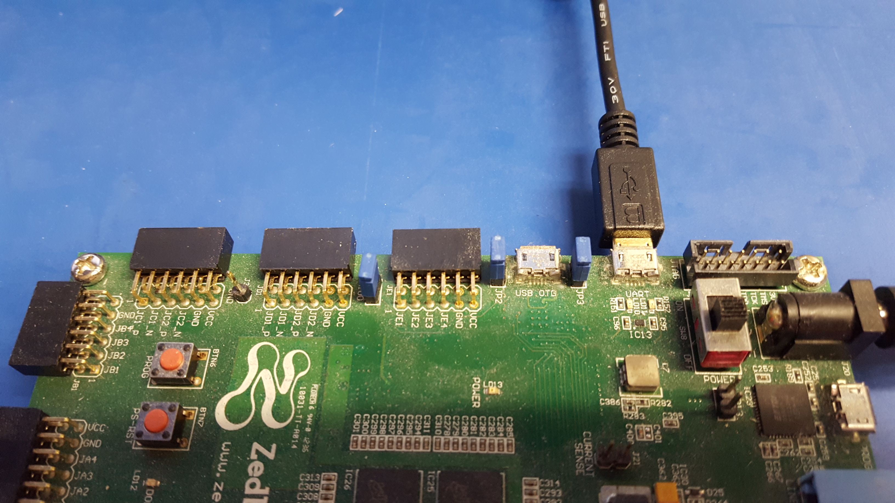
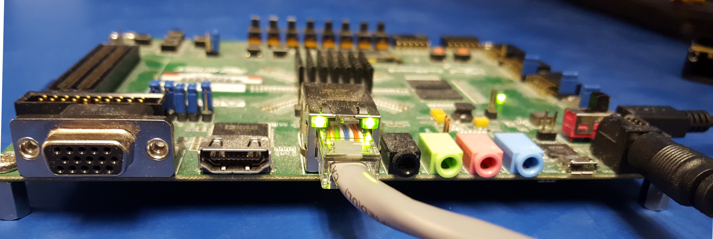
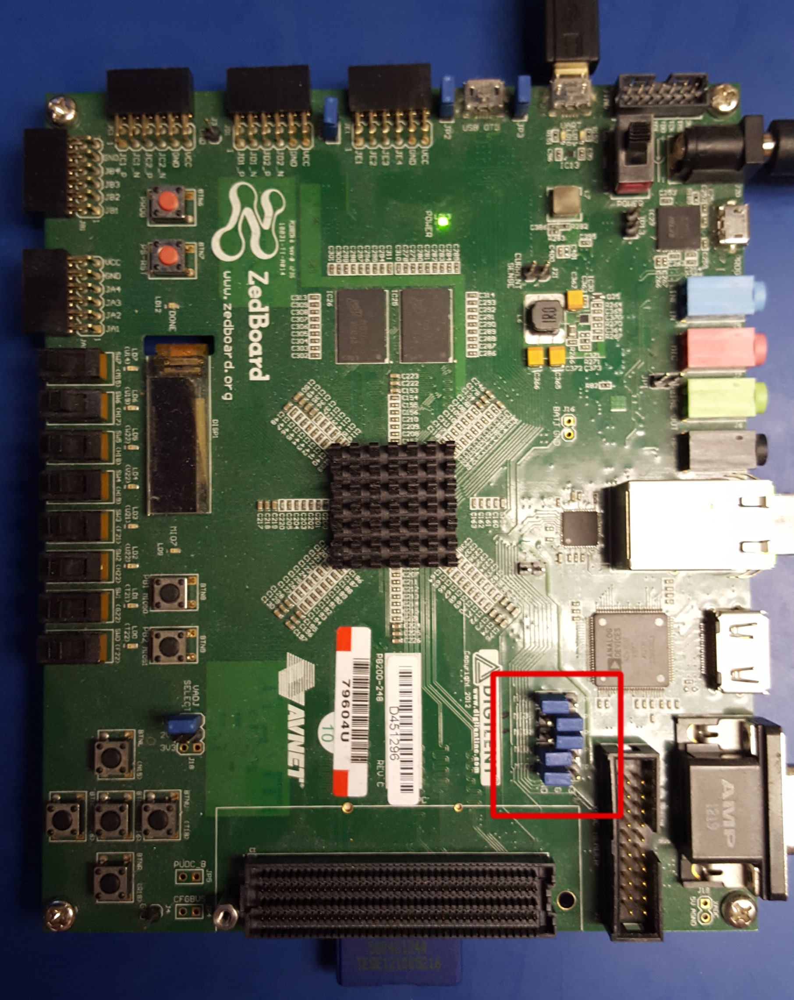
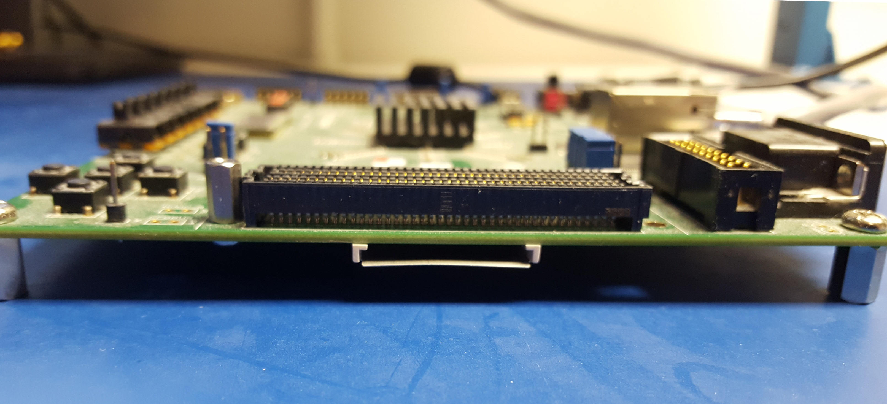
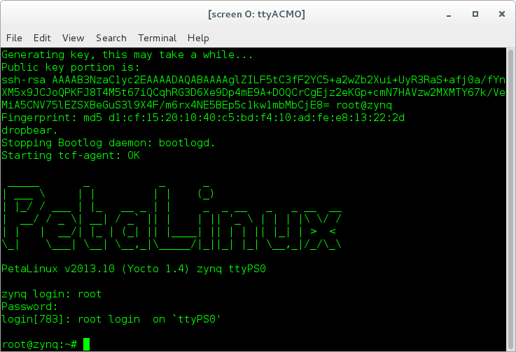

.. zed_gsg OpenCPI ZedBoard Getting Started Guide documentation

.. This file is protected by Copyright. Please refer to the COPYRIGHT file
   distributed with this source distribution.

   This file is part of OpenCPI <http://www.opencpi.org>

   OpenCPI is free software: you can redistribute it and/or modify it under the
   terms of the GNU Lesser General Public License as published by the Free
   Software Foundation, either version 3 of the License, or (at your option) any
   later version.

   OpenCPI is distributed in the hope that it will be useful, but WITHOUT ANY
   WARRANTY; without even the implied warranty of MERCHANTABILITY or FITNESS FOR
   A PARTICULAR PURPOSE. See the GNU Lesser General Public License for
   more details.

   You should have received a copy of the GNU Lesser General Public License
   along with this program. If not, see <http://www.gnu.org/licenses/>.

.. _zed_gsg:

.. Below are definitions for copyright and trademark symbols.

.. |trade| unicode:: U+2122
   :ltrim:

.. |reg| unicode:: U+00AE
   :ltrim:

.. Note that you need to use two underscores in hyperlinks to Installation Guide to avoid duplicate explicit target info warnings.

OpenCPI ZedBoard Getting Started Guide
======================================

Document Revision History
-------------------------

.. csv-table:: OpenCPI ZedBoard Getting Started Guide: Revision History
   :header: "Revision", "Description of Change", "Date"
   :widths: 10,30,10
   :class: tight-table

   "v1.1", "Initial Release", "3/2017"
   "v1.2", "Updated for OpenCPI Release 1.2", "8/2017"
   "v1.3", "Updated for OpenCPI Release 1.3", "2/2018"
   "pre-v1.4", "Fixed inaccurate description for hardware jumper configuration, OpenCPI-SD-zed directory path, and MAC address modification instructions for multiple Zedboards on the same network", "4/2018"
   "v1.4", "Update descriptions and paths", "9/2018"
   "v1.5", "Deprecate Zipper", "4/2018"
   "v1.6", "Refer to Installation Guide where possible", "1/2020"
   "v2.2", "Convert to RST, update to xilinx19_2_aarch32", "4/2021"
   "v2.4", "Update to reference Install Guide, User Guide, follow new system GSG template, remove deprecated Zipper", "12/2022"

How to Use This Document
------------------------

This document provides installation information that is specific
to setting up the OpenCPI Avnet (Digilent) ZedBoard\ |trade|
embedded system for use with OpenCPI.
It describes system-specific details, if any, about setting up:

* The platforms that comprise the system

* The system as a whole

Use this document in conjunction with the
`OpenCPI Installation Guide <https://opencpi.gitlab.io/releases/develop/docs/OpenCPI_Installation_Guide.pdf>`__,
which describes the general steps to enable OpenCPI for use on an embedded system.
Use this guide as a companion to the *OpenCPI Installation Guide*, especially when
performing the steps described in the chapter "Enabling OpenCPI Development
for Embedded Systems". It provides details about the ZedBoard system that
can be applied to the procedures described in that section.

The following documents can also be used as reference to the tasks described in this document:

* `OpenCPI User Guide <https://opencpi.gitlab.io/releases/latest/docs/OpenCPI_User_Guide.pdf>`_
  
* `OpenCPI Glossary <https://opencpi.gitlab.io/releases/latest/docs/OpenCPI_Glossary.pdf>`_

Note that the *OpenCPI Glossary* is also contained in both the *OpenCPI Installation Guide* and the
*OpenCPI User Guide*.

This document assumes a basic understanding of the Linux command line (or "shell") environment.

Overview
--------
The ZedBoard is a Xilinx\ |reg| Zynq-based system
that consists of an RCC/CPU (software) "PS" platform and an HDL (FPGA) "PL" platform
connected by an Advanced Extensible Interface (AXI) bus.
See the product brief at https://www.avnet.com/wps/portal/us/products/avnet-boards/avnet-board-families/zedboard/
for detailed information about the ZedBoard.

In OpenCPI, the embedded RCC platform is ``xilinx19_2_aarch32`` 
and the HDL platform is ``zed`` (the default) or ``zed_ise`` (to support
older Xilinx ISE tools in cases where use of these older tools is required).

Installation Prerequisites
--------------------------
The following items are required for OpenCPI ZedBoard system installation and setup:

* Avnet (Digilent) ZedBoard

* 12V power supply

* micro-USB to USB-A cable

* micro-USB to female-USB-A adapter

* microSD card: use the one that comes with the product kit or provide a different one (OpenCPI ZedBoard setup has been tested using a 4GB microSD card)

These items are typically provided with the ZedBoard product kit.

An SD card reader is also required.

.. note::

   Ignore any quick start cards or instructions that come with the product kit.
   This getting started guide and the `OpenCPI Installation Guide <https://opencpi.gitlab.io/releases/latest/docs/OpenCPI_Installation_Guide.pdf>`__
   provide the necessary instructions for setting up the ZedBoard for OpenCPI.

The following items are optional:

* 1-Gigabit Ethernet cable

* Analog Devices FMCOMMS2 or FMCOMMS3 daughtercard

OpenCPI has been tested on ZedBoard revisions C and D.

Installation Steps for Platforms
--------------------------------
This section contains details about the ZedBoard that pertain to the
instructions for installing OpenCPI platforms in the section
"Installation Steps for Platforms" in the
`OpenCPI Installation Guide <https://opencpi.gitlab.io/releases/develop/docs/OpenCPI_Installation_Guide.pdf>`__.

Details for Installing the RCC Platform
~~~~~~~~~~~~~~~~~~~~~~~~~~~~~~~~~~~~~~~
The ZedBoard system supports the RCC platform ``xilinx19_2_aarch32``, which
is also used by other systems such as the Ettus E310 (``e31x``).
If this platform has already been installed and built for another system,
it can apply to the ZedBoard and does not need to be installed and built.

Details for Installing the HDL Platform
~~~~~~~~~~~~~~~~~~~~~~~~~~~~~~~~~~~~~~~
As described in the *OpenCPI Installation Guide*, each OpenCPI platform
depends on a set of third-party/vendor tools that need to be manually
installed so that the platform can be built. OpenCPI supports two
different FPGA/HDL platforms for the ZedBoard:

* The ``zed`` platform (HDL target ``zynq``), which is built with
  the Xilinx Vivado tools

* The ``zed_ise`` platform (HDL target ``zynq_ise``), which is
  built with the Xilinx ISE tools

If your environment requires the use of Xilinx ISE tools rather
than the (recommended) Xilinx Vivado tools, you need to target the
``zed_ise`` platform for building bitstreams for the ZedBoard,
not the ``zed`` platform.

Setting up the ZedBoard After its Platforms are Installed
---------------------------------------------------------
This section describes steps to enable the OpenCPI development and execution environment
that must be performed on the ZedBoard after its platforms have been
installed. It also contains setup information specific to the ZedBoard system
that is needed when performing the tasks described in the section
"Installation Steps for Systems After their Platforms are Installed"
in the
`OpenCPI Installation Guide <https://opencpi.gitlab.io/releases/latest/docs/OpenCPI_Installation_Guide.pdf>`__.

Details for Establishing a Serial Console Connection
~~~~~~~~~~~~~~~~~~~~~~~~~~~~~~~~~~~~~~~~~~~~~~~~~~~~
This section contains details about the ZedBoard that pertain to the
instructions for setting up a serial I/O console described in the section
"Establishing a Serial Console Connection" in the
`OpenCPI Installation Guide <https://opencpi.gitlab.io/releases/latest/docs/OpenCPI_Installation_Guide.pdf>`__:

* On Zedboard systems, the micro-USB serial port, labeled **UART** and located on the top side of the ZedBoard, can be used to access the serial connection with the processor.

   Connected Serial USB

* The console serial port operates at 115200 baud. The cable used is a micro-USB to USB-A cable to connect its console micro-USB port to the development host.
  
Details for Configuring the Runtime Environment on the Embedded System
~~~~~~~~~~~~~~~~~~~~~~~~~~~~~~~~~~~~~~~~~~~~~~~~~~~~~~~~~~~~~~~~~~~~~~
This section contains details about the ZedBoard that pertain to the
instructions for configuring the runtime environment on the embedded
system described in the section "Configuring the Runtime Environment on the Embedded System" in the
`OpenCPI Installation Guide <https://opencpi.gitlab.io/releases/latest/docs/OpenCPI_Installation_Guide.pdf>`__.

Connecting the ZedBoard to a DHCP-supported Network (Optional)
^^^^^^^^^^^^^^^^^^^^^^^^^^^^^^^^^^^^^^^^^^^^^^^^^^^^^^^^^^^^^^
Using server mode or network mode for OpenCPI on the ZedBoard embedded
system requires establishing an Ethernet connection from the ZedBoard to a network that supports DHCP.

There is one Ethernet port located on the ZedBoard. Use a 1-Gigabit Ethernet cable to connect
this port to the DHCP-supported network, as shown in :numref:`zed-ether`

.. _zed-ether:

   Connected Ethernet
   
Booting the ZedBoard from the SD Card
^^^^^^^^^^^^^^^^^^^^^^^^^^^^^^^^^^^^^
The ZedBoard needs to be configured to boot from the SD card. To configure the board and then boot from the SD card:

1. Remove power from the ZedBoard.

2. Set the following jumpers on the top of the ZedBoard to boot from the SD card, as shown in :numref:`zed-jumpers`
   
   * Set JP10 to 3.3V.

   * Set JP9 to 3.3V.

   * Set JP8 to GND.

   * Set VADJ SELECT (J18) to 2V5 to ensure proper FPGA Mezzanine Card (FMC) configuration. The only supported FMC voltage for OpenCPI bitstreams is 2.5V.

.. _zed-jumpers:

   Zedboard Top View with J10, J9, J8 Set

3. Insert the SD card into the SD card slot. The SD card slot is located below the FMC Low Pin Count (LPC) slot for an optional daughtercard on the bottom side of the ZedBoard, as shown in :numref:`zed-sd`

.. _zed-sd:

   ZedBoard FMC LPC Slot and SD Card Slot

4. Connect a terminal to the micro-USB connector on the Zedboard labeled **UART**. The baud rate should be 115200.

5. On the development host, start the terminal emulator (usually with the ``screen`` command) at 115200 baud.

6. Apply power to the Zedboard with the terminal still connected.

Continuing a Stopped Boot Sequence
^^^^^^^^^^^^^^^^^^^^^^^^^^^^^^^^^^
The ZedBoard system is initially set with ``root`` for user name and password. Typically, on initial power-on of the platform, the boot sequence will stop at the ``uboot`` configuration prompt. When this occurs, simply enter ``boot`` to allow the boot sequence to continue:

.. code-block::

   $ zynq-uboot> boot

After a successful boot to PetaLinux, log in to the system using ``root`` for user name and password, as shown in :numref:`boot-seq`

.. _boot-seq:

   Successful Boot to PetaLinux

Enabling the Network Interface (Optional)
^^^^^^^^^^^^^^^^^^^^^^^^^^^^^^^^^^^^^^^^^
When a single ZedBoard is on the network, execute the following command to enable its Ethernet interface:

.. code-block::

   $ ifconfig eth0 up

When multiple ZedBoards are on the network, you must modify the ``mynetsetup.sh`` script according to the instructions in the section "Connecting HDL Platforms to an Ethernet Network" in the `OpenCPI Installation Guide <https://opencpi.gitlab.io/releases/develop/docs/OpenCPI_Installation_Guide.pdf>`__ before you proceed to running the test application.

