Authors
=======
Davis Hoover (git@davishoover.com)
Joel Palmer (jpalmer@geontech.com)

Supported Versions
==================
The ocpidev2 script is generally meant to work across OpenCPI projects, according
to the various Development Guides (Component Dev Guide, HDL Dev Guide, RCC Dev
Guide, Platform Dev Guide, etc). Many
pre-2.0 OpenCPI mechanisms, nameonly GNU Make variables in makefiles across a
project, still exist in 2.0-and-after OpenCPI projects. The ocpidev2 script
is written to generally make projects out in the wild "just work", in that
build/show finds them and can build them. Pre-OpenCPI-2.0 documentation can be seen
here, for example: https://gitlab.com/opencpi/opencpi/-/blob/v1.7.0/doc/odt/OpenCPI_Component_Development_Guide.fodt

Coding Style
============
PEP-8 was used during development. The python pycodestyle command was used to
confirm compliance.

Comparison with ocpidev
=======================
The ocpidev script supports the verbs
build/clean/create/delete/register/run/set/show/unregister/unset.
The ocpidev2 script supports the verbs
build/clean/create/delete/register/show/unregister but not set/unset/delete.
The set/unset operations are not recommended with ocpidev2 (use OCPI_PROJECT_REGISTRY_DIR instead).
The delete/run are not implemented but it is recommended to implement these in
ocpidev2 in the future and delete ocpidev entirely. At the time of this writing,
ocpidev2 is about 5500 lines whereas ocpidev is about 7000 lines.

Architecture
============
OpenCPI concepts are typically created as small data structures correspond to
their documentation/XML definitions. Objects do not known about their
containing directories or what they represent (this is an important key
concept - eventually portions of ocpidev2 could be ported to C++ and merged
with the respective asset classes to reduce software entropy). This helps keep
each concept
class small and scoped similar to their corresponding Dev Guide documentation.
The Project and ProjectDatabase classes do a lot of the heavy lifting
for project traversion. Assets undergo build/clean/show/etc from the perspective
of a ProjectDatabase.

The AttributeBase class normalizes parsing across XML and makefiles and
for all asset type. The AssetBase class inherits from AttributeBase and is
common to all asset classes. Asset classes exist per OpenCPI concept
(Component/Worker/etc) and are generally named according to their XML root
tags.

Discovery
=========
Existing assets are performed automously by a discovery mechanism. All
asset classes have a discover() method which creates a database
in internal program memory which represents the discoverable assets
on the filesystem. Assets are discovered 1) from the local project
and 2) from the project registry. Refer to the Component Dev Guide
for more info.

Attribute Parsing
=================
Discovery performs parsing of XML and makefiles. All
asset classes have a parse() method. All parsed values are printed
when the log level is set to 10.
XML tags are always defined in the python code in the same upper camel case as
the documentation (Dev Guides), e.g., HdlAssembly is defined in a certain
get_root_tags()
method. Parsed attributes are stored in the classes, self.attrs dictionary,
e.g. self.attrs['Spec'] = 'drc'.
The attribute case variants, e.g., hdlassembly vs HdlAssembly
occuring in an XML file,
are handled within the XML parsing classes (AttributeBase) that compare the
lower case of everything.

Testing
=======
A unit tests is written in python. Coverage at the time if this writing
is somewhere around 50% by lines of code. There
is also a tools/ocpidev2/test.sh which performs all existing ocpidev2 tests.
This includes the python unit tests and various CLI commands.

Component Library Behavior
==========================
The following expands on the Dev Guides by clarifying what is considered a
component library. The 'ocpidev2 show libraries' command shows components
libraries.

A directory is a Component Library
1)  if and only if it does not contain directories that are themselves component libraries
2)  if and only if it does not contain an XML file containing the root tag Libraries
3)  if and only if its path is within one of the following standard locations within an OpenCPI project
  * <project>/components/
  * <project>/components/<library>/
  * <project>/hdl/devices/
  * <project>/hdl/cards/
  * <project>/hdl/adapters/
  * <project>/hdl/platforms/<platform>/devices/

Furthermore, none of <project>/specs, <library>/specs, or <project>/hdl/platforms/<platform> are themselves a component library.

Asset objects
=============

        CLI   XML   makefiles
         |     |      |
         V     V      V
    asset object (inherits from AssetBase) self.attrs

Top-Level Attribute, Exposing to CLI
====================================

Note that 'git grep cli_dict' is helpful in tying the following description to the codebase.

1. Top-level attributes, e.g. SourceFiles, and all of their associated information are defined by the list returned in each asset class's get_attr_infos() method
2. Top-level attributes are typically exposed to the CLI, in a name that is similar to the attribute (sometimes not).

    args.include_dirs (matches attribute cli[1] defined in get_attr_infos())

      =DICT()=>

    mydict["include_dir"]

      =replaceunderscore=>

    mydict["includedir"]

      =lowercase=>

    cli_dict["includedir"]

      =>

    "includedir"

      <=COMPARE=>

    "includedir"

      <== lower()

    "IncludeDir" (matches attribute name defined in get_attr_infos())

      <=

    self.attrs["IncludeDir"]

Troubleshooting
===============
It is VERY useful to run OCPI_LOG_LEVEL=10 ocpidev2 ...args.... 2> log, and then less -r log to peruse the colorized output
